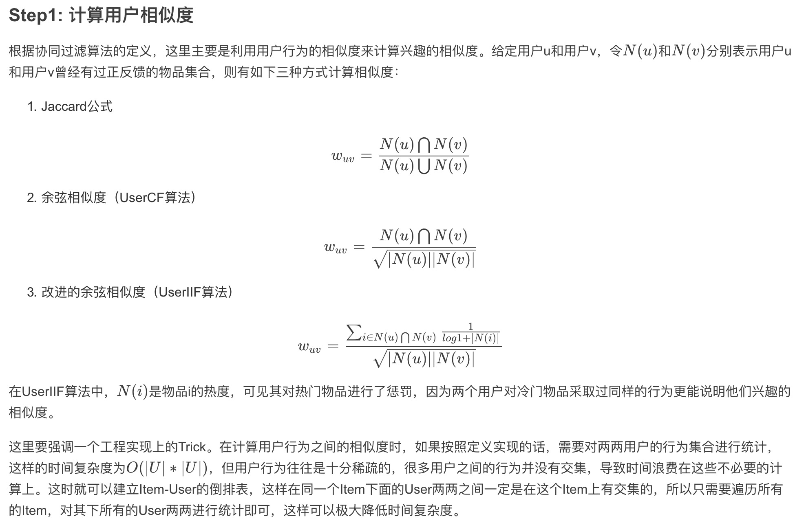
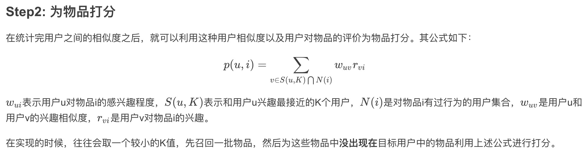
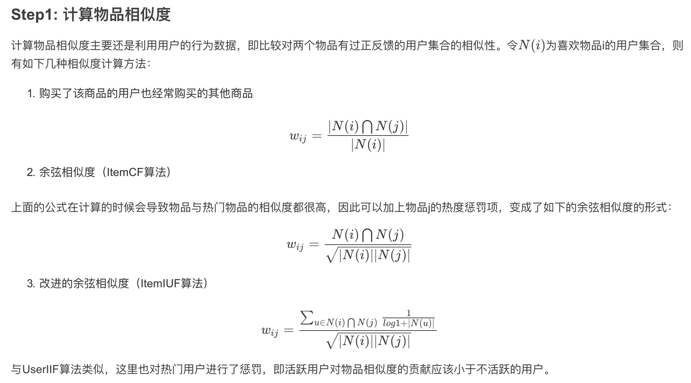
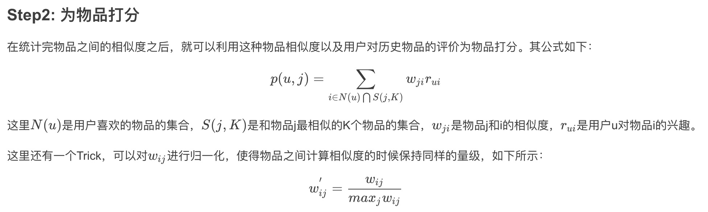
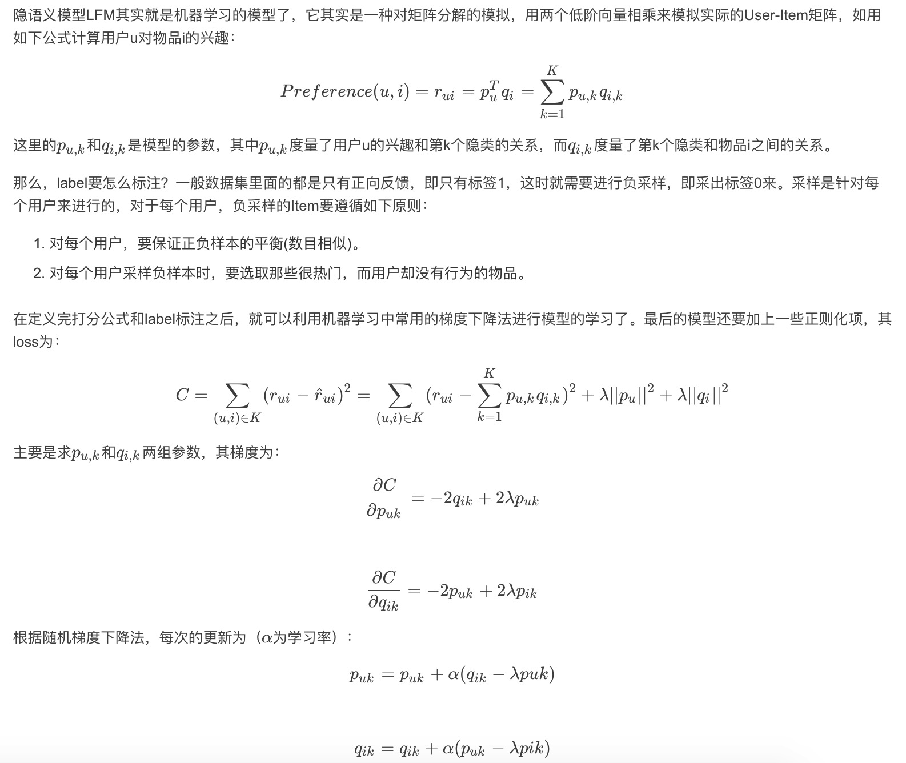
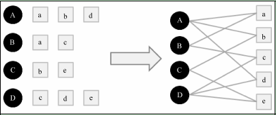
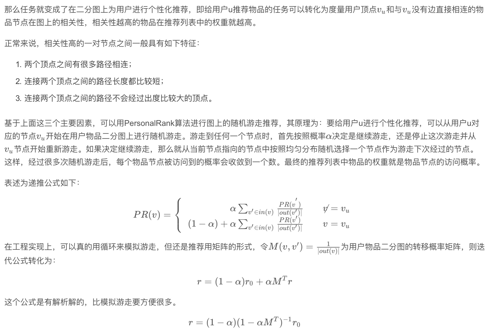
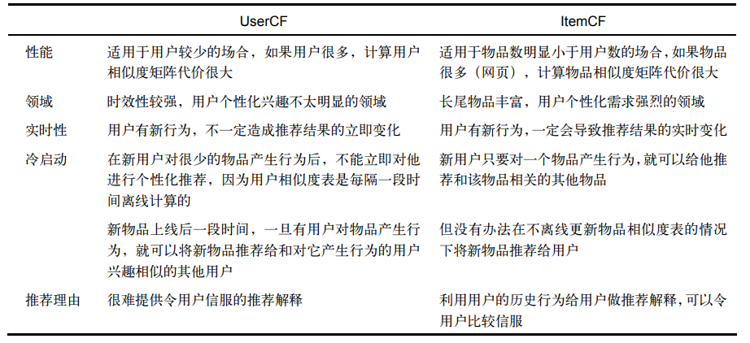
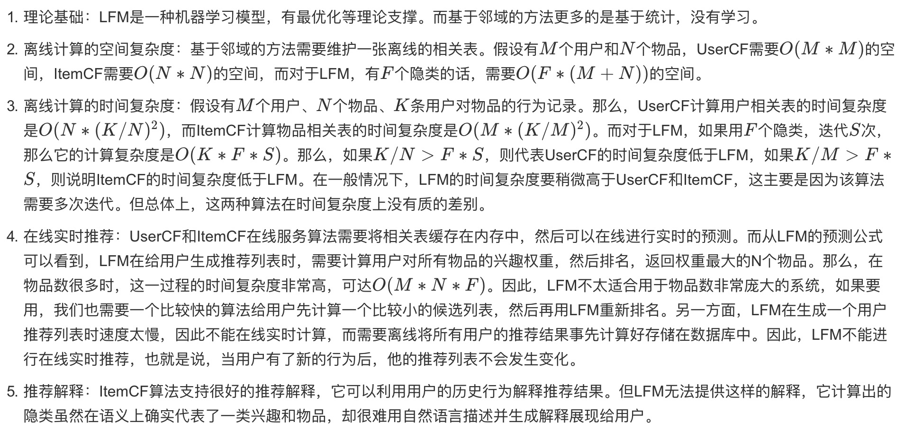

这部分的所有算法均采用MoviesLens作为数据集，选取的是中等大小数据集，包含6000多用户对4000多部电影的100万条评分。

# 2 协同过滤
基于邻域的算法是推荐系统中最基本的算法，该算法不仅在学术界得到了深入研究，而且在 业界得到了广泛应用。基于邻域的算法分为两大类，一类是基于用户的协同过滤算法，另一类是 基于物品的协同过滤算法。
这里要先声明一点，仅仅**基于用户行为数据设计的推荐算法一般称为协同过滤算法。**

## 2.1 基于用户的协同过滤算法
主要包含两个步骤：
* a. 计算用户之间的相似度：找到和目标用户兴趣相似的用户集合。
* b. 根据用户相似度及用户对物品的评价为物品打分：找到这个集合中的用户喜欢的，且目标用户没有听说过的物品推荐给目标用户。




## 2.2 基于物品的协同过滤算法
与基于用户的协同过滤算法一样，基于物品的协同过滤算法也是**基于邻域的一种做法**。它也可以分为两步：
* a. 计算物品之间的相似度。
* b. 根据物品的相似度和用户的历史行为为用户生成推荐列表。




## 2.3 隐语义模型


## 2.4 基于图的模型
用户的行为（User, Item）是可以表示为二分图的，比如下图：



## 2.5 各算法比较

### 2.5.1 UserCF和ItemCF的综合比较

UserCF比较古老，而ItemCF则相对较新
* UserCF给用户推荐那些和他有共同兴趣爱好的用户喜欢的物品，而ItemCF给用户推荐那些和他之前喜欢的物品类似的物品。从这个算法的原理可以看到，UserCF的推荐结果着重于反映和用户兴趣相似的小群体的热点，而ItemCF的推荐结果着重于维系用户的历史兴趣。换句话说，UserCF的推荐更社会化，反映了用户所在的小型兴趣群体中物品的热门程度，而ItemCF的推荐更加个性化，反映了用户自己的兴趣传承。
* UserCF比较适合用于新闻推荐等热门程度和实时性较强的场景。比如一个人看新闻不可能每天只看和之前看的相关的那些，更多的是看今天有哪些新的热门的。从原理上讲，UserCF可以给用户推荐和他有相似爱好的一群其他用户今天都在看的新闻，这样在抓住热点和时效性的同时，保证了一定程度的个性化。从技术角度讲，UserCF主要是维护用户相似度表，在这种场景下，物品的更新速度远超用户，所以维护物品相似度表难度和成本都较高。
* ItemCF则适用于图书、电商、电影等场景。首先这些场景中用户的兴趣是比较固定和长久的，而且一般物品更新的速度不会特别快。

总结如下：


### 2.5.2 LFM与基于邻域的方法的比较


结果：
## 基于用户的协同过滤算法
```
/Users/zhaoyadong/anaconda3/envs/nlp/bin/python /Users/zhaoyadong/opt/git/RecommendSystemPractice/Chapter2/userCF.py
Func loadData, run time: 1.1881048679351807
Func splitData, run time: 1.7216088771820068
Experiment 0:
Metric: {'Precision': 0.61, 'Recall': 0.29, 'Coverage': 100.0, 'Popularity': 4.3952}
Func worker, run time: 15.457796096801758
Func splitData, run time: 1.682007074356079
Experiment 1:
Metric: {'Precision': 0.61, 'Recall': 0.29, 'Coverage': 100.03, 'Popularity': 4.384244}
Func worker, run time: 15.371079921722412
Func splitData, run time: 1.6726808547973633
Experiment 2:
Metric: {'Precision': 0.64, 'Recall': 0.3, 'Coverage': 100.0, 'Popularity': 4.38938}
Func worker, run time: 15.476614236831665
Func splitData, run time: 1.6619791984558105
Experiment 3:
Metric: {'Precision': 0.62, 'Recall': 0.3, 'Coverage': 100.0, 'Popularity': 4.393025}
Func worker, run time: 15.937459945678711
Func splitData, run time: 1.6709396839141846
Experiment 4:
Metric: {'Precision': 0.61, 'Recall': 0.3, 'Coverage': 100.0, 'Popularity': 4.393217}
Func worker, run time: 15.444214105606079
Func splitData, run time: 1.6534512042999268
Experiment 5:
Metric: {'Precision': 0.57, 'Recall': 0.27, 'Coverage': 100.03, 'Popularity': 4.388441}
Func worker, run time: 15.869057893753052
Func splitData, run time: 1.7103190422058105
Experiment 6:
Metric: {'Precision': 0.61, 'Recall': 0.29, 'Coverage': 100.0, 'Popularity': 4.382586}
Func worker, run time: 15.570866823196411
Func splitData, run time: 1.687302827835083
Experiment 7:
Metric: {'Precision': 0.61, 'Recall': 0.29, 'Coverage': 100.0, 'Popularity': 4.390586}
Func worker, run time: 15.540002822875977
Average Result (M=8, K=0, N=10): {'Precision': 0.61, 'Recall': 0.29125, 'Coverage': 100.0075, 'Popularity': 4.389584875000001}
Func run, run time: 139.4550621509552
Func loadData, run time: 1.170201063156128
Func splitData, run time: 1.6674728393554688
Experiment 0:
Metric: {'Precision': 12.85, 'Recall': 6.17, 'Coverage': 2.47, 'Popularity': 7.724273}
Func worker, run time: 9.127410173416138
Func splitData, run time: 1.658980131149292
Experiment 1:
Metric: {'Precision': 13.07, 'Recall': 6.26, 'Coverage': 2.28, 'Popularity': 7.721385}
Func worker, run time: 9.096608877182007
Func splitData, run time: 1.6868958473205566
Experiment 2:
Metric: {'Precision': 12.89, 'Recall': 6.16, 'Coverage': 2.44, 'Popularity': 7.722067}
Func worker, run time: 9.114238977432251
Func splitData, run time: 1.671959638595581
Experiment 3:
Metric: {'Precision': 12.81, 'Recall': 6.15, 'Coverage': 2.49, 'Popularity': 7.723152}
Func worker, run time: 9.28702712059021
Func splitData, run time: 1.7275469303131104
Experiment 4:
Metric: {'Precision': 12.7, 'Recall': 6.11, 'Coverage': 2.47, 'Popularity': 7.724644}
Func worker, run time: 9.212229013442993
Func splitData, run time: 1.6749958992004395
Experiment 5:
Metric: {'Precision': 12.9, 'Recall': 6.22, 'Coverage': 2.38, 'Popularity': 7.7234}
Func worker, run time: 9.309902667999268
Func splitData, run time: 1.7355432510375977
Experiment 6:
Metric: {'Precision': 12.91, 'Recall': 6.21, 'Coverage': 2.47, 'Popularity': 7.721658}
Func worker, run time: 9.72655200958252
Func splitData, run time: 1.7082159519195557
Experiment 7:
Metric: {'Precision': 12.53, 'Recall': 6.01, 'Coverage': 2.41, 'Popularity': 7.725531}
Func worker, run time: 9.619157075881958
Average Result (M=8, K=0, N=10): {'Precision': 12.832500000000001, 'Recall': 6.16125, 'Coverage': 2.42625, 'Popularity': 7.723263749999999}
Func run, run time: 89.33113288879395
Func loadData, run time: 1.2195439338684082
Func splitData, run time: 1.709820032119751
Experiment 0:
Metric: {'Precision': 16.9, 'Recall': 8.12, 'Coverage': 52.44, 'Popularity': 6.819093}
Func worker, run time: 178.59335088729858
Func splitData, run time: 1.7759218215942383
Experiment 1:
Metric: {'Precision': 17.04, 'Recall': 8.16, 'Coverage': 52.06, 'Popularity': 6.815413}
Func worker, run time: 173.5899579524994
Func splitData, run time: 1.728787899017334
Experiment 2:
Metric: {'Precision': 16.91, 'Recall': 8.08, 'Coverage': 51.75, 'Popularity': 6.818886}
Func worker, run time: 179.99021887779236
Func splitData, run time: 1.7774839401245117
Experiment 3:
Metric: {'Precision': 16.94, 'Recall': 8.14, 'Coverage': 52.14, 'Popularity': 6.817815}
Func worker, run time: 180.98230123519897
Func splitData, run time: 1.7676422595977783
Experiment 4:
Metric: {'Precision': 17.06, 'Recall': 8.2, 'Coverage': 52.12, 'Popularity': 6.82111}
Func worker, run time: 184.90010786056519
Func splitData, run time: 1.7675230503082275
Experiment 5:
Metric: {'Precision': 16.75, 'Recall': 8.08, 'Coverage': 51.91, 'Popularity': 6.818678}
Func worker, run time: 183.76134300231934
Func splitData, run time: 1.698348045349121
Experiment 6:
Metric: {'Precision': 16.68, 'Recall': 8.02, 'Coverage': 51.71, 'Popularity': 6.82425}
Func worker, run time: 174.4759919643402
Func splitData, run time: 1.7141401767730713
Experiment 7:
Metric: {'Precision': 16.86, 'Recall': 8.09, 'Coverage': 52.56, 'Popularity': 6.819087}
Func worker, run time: 167.10042715072632
Average Result (M=8, K=5, N=10): {'Precision': 16.8925, 'Recall': 8.11125, 'Coverage': 52.08624999999999, 'Popularity': 6.8192915}
Func run, run time: 1438.7286801338196
Func loadData, run time: 1.1307120323181152
Func splitData, run time: 1.626115083694458
Experiment 0:
Metric: {'Precision': 20.52, 'Recall': 9.86, 'Coverage': 41.95, 'Popularity': 6.982226}
Func worker, run time: 165.7985861301422
Func splitData, run time: 1.6533520221710205
Experiment 1:
Metric: {'Precision': 20.46, 'Recall': 9.8, 'Coverage': 42.06, 'Popularity': 6.972529}
Func worker, run time: 165.243736743927
Func splitData, run time: 1.6282098293304443
Experiment 2:
Metric: {'Precision': 20.61, 'Recall': 9.85, 'Coverage': 41.62, 'Popularity': 6.980192}
Func worker, run time: 167.91851592063904
Func splitData, run time: 1.6218199729919434
Experiment 3:
Metric: {'Precision': 20.41, 'Recall': 9.81, 'Coverage': 41.47, 'Popularity': 6.97886}
Func worker, run time: 220.12871885299683
Func splitData, run time: 1.9780809879302979
Experiment 4:
Metric: {'Precision': 20.59, 'Recall': 9.9, 'Coverage': 41.5, 'Popularity': 6.980629}
Func worker, run time: 177.58713603019714
Func splitData, run time: 1.648055076599121
Experiment 5:
Metric: {'Precision': 20.33, 'Recall': 9.81, 'Coverage': 41.26, 'Popularity': 6.981318}
Func worker, run time: 171.58475995063782
Func splitData, run time: 1.641706943511963
Experiment 6:
Metric: {'Precision': 20.19, 'Recall': 9.71, 'Coverage': 41.49, 'Popularity': 6.976388}
Func worker, run time: 170.21002078056335
Func splitData, run time: 1.635408878326416
Experiment 7:
Metric: {'Precision': 20.58, 'Recall': 9.87, 'Coverage': 41.8, 'Popularity': 6.980981}
Func worker, run time: 178.9041028022766
Average Result (M=8, K=10, N=10): {'Precision': 20.46125, 'Recall': 9.826250000000002, 'Coverage': 41.64375, 'Popularity': 6.979140375}
Func run, run time: 1432.1169810295105
Func loadData, run time: 1.253093957901001
Func splitData, run time: 1.7087900638580322
Experiment 0:
Metric: {'Precision': 23.11, 'Recall': 11.1, 'Coverage': 32.6, 'Popularity': 7.104519}
Func worker, run time: 187.4276397228241
Func splitData, run time: 1.7617430686950684
Experiment 1:
Metric: {'Precision': 22.96, 'Recall': 10.99, 'Coverage': 33.0, 'Popularity': 7.094808}
Func worker, run time: 179.56237983703613
Func splitData, run time: 1.6486546993255615
Experiment 2:
Metric: {'Precision': 23.2, 'Recall': 11.09, 'Coverage': 32.1, 'Popularity': 7.101386}
Func worker, run time: 184.04693913459778
Func splitData, run time: 1.670428991317749
Experiment 3:
Metric: {'Precision': 22.87, 'Recall': 10.99, 'Coverage': 32.77, 'Popularity': 7.101266}
Func worker, run time: 186.2440891265869
Func splitData, run time: 1.7168641090393066
Experiment 4:
Metric: {'Precision': 23.0, 'Recall': 11.06, 'Coverage': 33.25, 'Popularity': 7.10377}
Func worker, run time: 180.33998823165894
Func splitData, run time: 1.6399691104888916
Experiment 5:
Metric: {'Precision': 22.96, 'Recall': 11.07, 'Coverage': 32.48, 'Popularity': 7.10406}
Func worker, run time: 187.8500530719757
Func splitData, run time: 1.681189775466919
Experiment 6:
Metric: {'Precision': 22.83, 'Recall': 10.97, 'Coverage': 32.79, 'Popularity': 7.100858}
Func worker, run time: 189.6346080303192
Func splitData, run time: 2.055389881134033
Experiment 7:
Metric: {'Precision': 23.0, 'Recall': 11.03, 'Coverage': 33.27, 'Popularity': 7.108237}
Func worker, run time: 190.85194516181946
Average Result (M=8, K=20, N=10): {'Precision': 22.99125, 'Recall': 11.037500000000001, 'Coverage': 32.7825, 'Popularity': 7.102363}
Func run, run time: 1501.2849700450897
Func loadData, run time: 1.2348642349243164
Func splitData, run time: 1.7748849391937256
Experiment 0:
Metric: {'Precision': 24.73, 'Recall': 11.88, 'Coverage': 25.8, 'Popularity': 7.204384}
Func worker, run time: 195.29796481132507
Func splitData, run time: 1.8009819984436035
Experiment 1:
Metric: {'Precision': 24.66, 'Recall': 11.81, 'Coverage': 26.03, 'Popularity': 7.19405}
Func worker, run time: 191.52182602882385
Func splitData, run time: 1.7435040473937988
Experiment 2:
Metric: {'Precision': 24.68, 'Recall': 11.8, 'Coverage': 25.66, 'Popularity': 7.20158}
Func worker, run time: 180.890123128891
Func splitData, run time: 1.6455390453338623
Experiment 3:
Metric: {'Precision': 24.46, 'Recall': 11.76, 'Coverage': 25.89, 'Popularity': 7.201308}
Func worker, run time: 179.63915610313416
Func splitData, run time: 1.6726112365722656
Experiment 4:
Metric: {'Precision': 24.25, 'Recall': 11.66, 'Coverage': 25.76, 'Popularity': 7.204154}
Func worker, run time: 192.69736003875732
Func splitData, run time: 1.7589049339294434
Experiment 5:
Metric: {'Precision': 24.46, 'Recall': 11.8, 'Coverage': 26.04, 'Popularity': 7.205482}
Func worker, run time: 197.74500679969788
Func splitData, run time: 1.7684910297393799
Experiment 6:
Metric: {'Precision': 24.49, 'Recall': 11.77, 'Coverage': 26.12, 'Popularity': 7.199023}
Func worker, run time: 198.21603798866272
Func splitData, run time: 1.754849910736084
Experiment 7:
Metric: {'Precision': 24.58, 'Recall': 11.79, 'Coverage': 25.79, 'Popularity': 7.207737}
Func worker, run time: 196.0868628025055
Average Result (M=8, K=40, N=10): {'Precision': 24.53875, 'Recall': 11.783749999999998, 'Coverage': 25.886249999999997, 'Popularity': 7.20221475}
Func run, run time: 1547.4183926582336
Func loadData, run time: 1.232468843460083
Func splitData, run time: 1.7630319595336914
Experiment 0:
Metric: {'Precision': 25.23, 'Recall': 12.12, 'Coverage': 20.35, 'Popularity': 7.288647}
Func worker, run time: 212.94039130210876
Func splitData, run time: 1.8335590362548828
Experiment 1:
Metric: {'Precision': 25.34, 'Recall': 12.13, 'Coverage': 20.2, 'Popularity': 7.280265}
Func worker, run time: 210.99239706993103
Func splitData, run time: 1.7445170879364014
Experiment 2:
Metric: {'Precision': 25.22, 'Recall': 12.06, 'Coverage': 20.03, 'Popularity': 7.28649}
Func worker, run time: 213.48196005821228
Func splitData, run time: 1.8301498889923096
Experiment 3:
Metric: {'Precision': 24.98, 'Recall': 12.01, 'Coverage': 20.29, 'Popularity': 7.288943}
Func worker, run time: 210.57559084892273
Func splitData, run time: 1.8487238883972168
Experiment 4:
Metric: {'Precision': 24.78, 'Recall': 11.91, 'Coverage': 20.33, 'Popularity': 7.289041}
Func worker, run time: 214.2945098876953
Func splitData, run time: 1.7983269691467285
Experiment 5:
Metric: {'Precision': 25.04, 'Recall': 12.08, 'Coverage': 20.4, 'Popularity': 7.290409}
Func worker, run time: 211.31487584114075
Func splitData, run time: 1.7878520488739014
Experiment 6:
Metric: {'Precision': 25.17, 'Recall': 12.1, 'Coverage': 20.0, 'Popularity': 7.286132}
Func worker, run time: 216.42471385002136
Func splitData, run time: 1.8159921169281006
Experiment 7:
Metric: {'Precision': 25.11, 'Recall': 12.04, 'Coverage': 20.4, 'Popularity': 7.295018}
Func worker, run time: 216.05026984214783
Average Result (M=8, K=80, N=10): {'Precision': 25.10875, 'Recall': 12.056249999999999, 'Coverage': 20.25, 'Popularity': 7.288118125}
Func run, run time: 1721.9261231422424
Func loadData, run time: 1.2444181442260742
Func splitData, run time: 1.76216721534729
Experiment 0:
Metric: {'Precision': 24.9, 'Recall': 11.96, 'Coverage': 15.34, 'Popularity': 7.369982}
Func worker, run time: 246.11052799224854
Func splitData, run time: 1.842689037322998
Experiment 1:
Metric: {'Precision': 25.07, 'Recall': 12.0, 'Coverage': 15.43, 'Popularity': 7.359478}
Func worker, run time: 243.06475186347961
Func splitData, run time: 1.821580171585083
Experiment 2:
Metric: {'Precision': 24.94, 'Recall': 11.92, 'Coverage': 15.51, 'Popularity': 7.365725}
Func worker, run time: 244.6321051120758
Func splitData, run time: 1.8776750564575195
Experiment 3:
Metric: {'Precision': 24.7, 'Recall': 11.87, 'Coverage': 15.57, 'Popularity': 7.367826}
Func worker, run time: 245.57813096046448
Func splitData, run time: 1.825192928314209
Experiment 4:
Metric: {'Precision': 24.54, 'Recall': 11.8, 'Coverage': 15.42, 'Popularity': 7.368641}
Func worker, run time: 246.52593207359314
Func splitData, run time: 1.839493989944458
Experiment 5:
Metric: {'Precision': 24.77, 'Recall': 11.95, 'Coverage': 15.52, 'Popularity': 7.370501}
Func worker, run time: 250.27117729187012
Func splitData, run time: 1.958773136138916
Experiment 6:
Metric: {'Precision': 24.9, 'Recall': 11.97, 'Coverage': 15.31, 'Popularity': 7.362657}
Func worker, run time: 256.25683403015137
Func splitData, run time: 1.819868803024292
Experiment 7:
Metric: {'Precision': 24.69, 'Recall': 11.84, 'Coverage': 15.04, 'Popularity': 7.375662}
Func worker, run time: 242.91132807731628
Average Result (M=8, K=160, N=10): {'Precision': 24.813750000000002, 'Recall': 11.91375, 'Coverage': 15.392499999999998, 'Popularity': 7.367559}
Func run, run time: 1991.5508890151978
Func loadData, run time: 1.2362761497497559
Func splitData, run time: 1.8199810981750488
Experiment 0:
Metric: {'Precision': 25.36, 'Recall': 12.18, 'Coverage': 21.33, 'Popularity': 7.26129}
Func worker, run time: 383.0601427555084
Func splitData, run time: 1.8515779972076416
Experiment 1:
Metric: {'Precision': 25.5, 'Recall': 12.21, 'Coverage': 21.39, 'Popularity': 7.248747}
Func worker, run time: 372.4530930519104
Func splitData, run time: 1.8760318756103516
Experiment 2:
Metric: {'Precision': 25.39, 'Recall': 12.14, 'Coverage': 21.33, 'Popularity': 7.255987}
Func worker, run time: 380.08861804008484
Func splitData, run time: 1.789999008178711
Experiment 3:
Metric: {'Precision': 25.08, 'Recall': 12.05, 'Coverage': 21.4, 'Popularity': 7.259753}
Func worker, run time: 378.0846152305603
Func splitData, run time: 1.8109362125396729
Experiment 4:
Metric: {'Precision': 24.92, 'Recall': 11.98, 'Coverage': 21.25, 'Popularity': 7.261206}
Func worker, run time: 376.07978224754333
Func splitData, run time: 1.7546601295471191
Experiment 5:
Metric: {'Precision': 25.14, 'Recall': 12.12, 'Coverage': 21.4, 'Popularity': 7.26109}
Func worker, run time: 379.1119980812073
Func splitData, run time: 1.7820663452148438
Experiment 6:
Metric: {'Precision': 25.19, 'Recall': 12.11, 'Coverage': 20.87, 'Popularity': 7.257091}
Func worker, run time: 376.67535400390625
Func splitData, run time: 1.7446508407592773
Experiment 7:
Metric: {'Precision': 25.15, 'Recall': 12.06, 'Coverage': 21.57, 'Popularity': 7.265932}
Func worker, run time: 373.7198700904846
Average Result (M=8, K=80, N=10): {'Precision': 25.21625, 'Recall': 12.106250000000001, 'Coverage': 21.3175, 'Popularity': 7.2588870000000005}
Func run, run time: 3035.1151690483093
```

## 基于物品的协同过滤算法

```

```