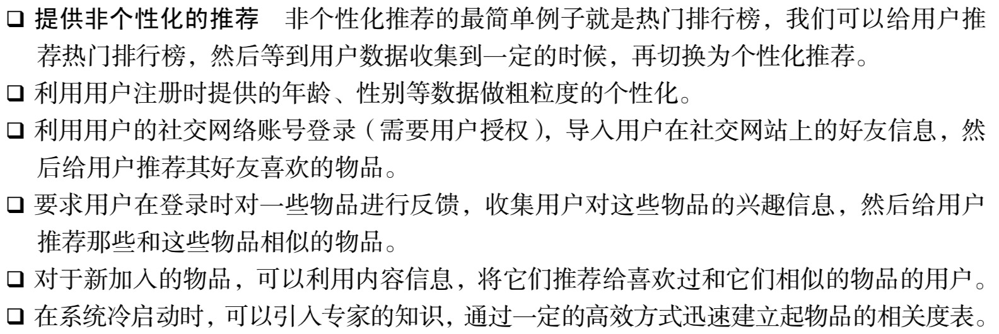
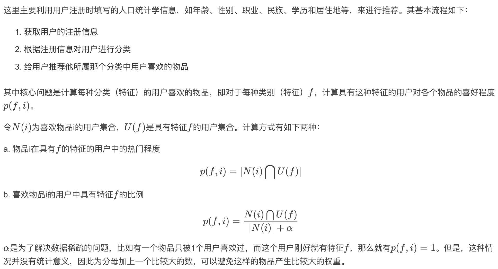
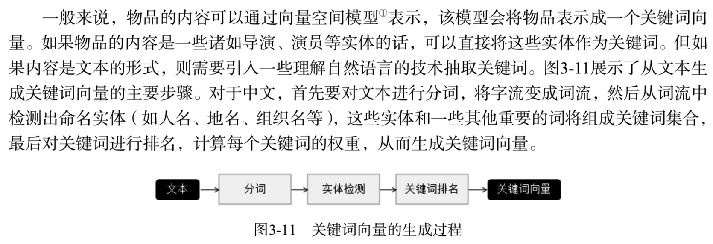
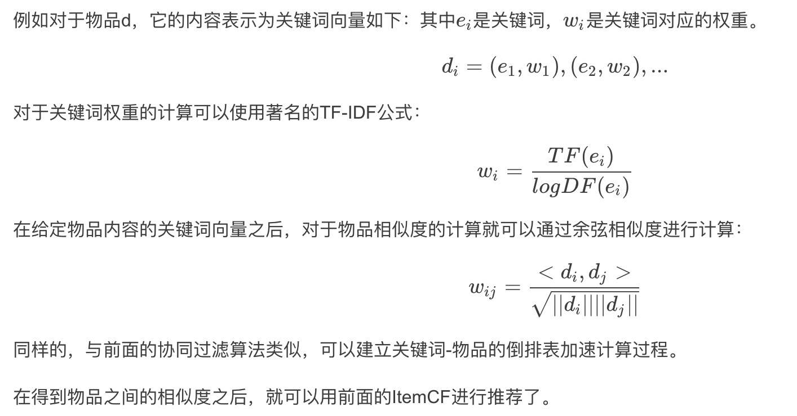

# 3 推荐系统冷启动问题

推荐系统需要根据用户的历史行为和兴趣预测用户未来的行为和兴趣，因此大量的用户行为数据就成为推荐系统的重要组成部分和先决条件。对于很多像百度这样的网站来说，这或
许不是个问题，因为它们目前已经积累了大量的用户数据。但是对于很多**做纯粹推荐系统的网站，或者很多在开始阶段就希望有个性化推荐应用的网站来说**，如何在没有大量用户数据的情况下设计个性化推荐系统并且让用户对推荐结果满意从而愿意使用推荐系统， 就是冷启动的问题。

冷启动问题主要分为3类：

- 用户冷启动：解决为新用户做个性化推荐的问题
- 物品冷启动：解决将新物品推荐给可能对它感兴趣的用户这一问题
- 系统冷启动：解决在新开发的网站上，没有用户，也没有用户行为，只有一些物品信息的推荐问题

这里主要分享两个算法:
- 一个是利用用户的注册信息进行冷启动
- 一个是利用物品本身信息进行冷启动

对于这3种不同的冷启动问题，有不同的解决方案。一般来说，可以参考如下解决方案。

## 3.1 利用用户注册信息

基于用户注册信息的推荐算法其核心问题是**计算每种特征的用户喜欢的物品。**

也就是说，对于每种特征f，计算具有这种特征的用户对各个物品的喜好程度p(f, i)。

## 3.2 利用物品的内容信息

物品冷启动需要解决的问题是如何将新加入的物品推荐给对它感兴趣的用户。物品冷启动在 新闻网站等时效性很强的网站中非常重要，因为那些网站中时时刻刻都有新加入的物品，而且每个物品必须能够在第一时间展现给用户，否则经过一段时间后，物品的价值就大大降低了。

第2章介绍了两种主要的推荐算法——UserCF和ItemCF算法。

- 首先需要指出的是，UserCF算法对物品冷启动问题并不非常敏感。因为，UserCF在给用户进行推荐时，会首先找到和用户兴趣相似的一群用户，然后给用户推荐这一群用户喜欢的物品。
在很多网站中，推荐列表并不是给用户展示内容的唯一列表，那么当一个新物品加入时，总会有用户从某些途径看到这些物品，对这些物品产生反馈。那么，当一个用户对某个物品产生反馈后，和他历史兴趣相似的其他用户的推荐列表中就有可能出现这一物品，从而更多的人就会对这个物品产生反馈，导致更多的人的推荐 列表中会出现这一物品，因此该物品就能不断地扩散开来，从而逐步展示到对它感兴趣用户的推荐列表中。但是，有些网站中推荐列表可能是用户获取信息的主要途径，比如豆瓣网络电台。那么对于UserCF算法就需要解决第一推动力的问题，
即第一个用户从哪儿发现新的物品。只要有一小部分人能够发现并喜欢新的物品，UserCF算法就能将这些物品扩散到更多的用户中。解决第一推动力最简单的方法是将新的物品随机展示给用户，但这样显然不太个性化，因此可以考虑利用物品的内容信息，将新物品先投放给曾经喜欢过和它内容相似的其他物品的用户。

- 对于ItemCF算法来说，物品冷启动就是一个严重的问题了。
**因为ItemCF算法的原理是给用户推荐和他之前喜欢的物品相似的物品。**
**ItemCF算法会每隔一段时间利用用户行为计算物品相似度表(一般一天计算一次)**，在线服务时ItemCF算法会将之前计算好的物品相关度矩阵放在内存中。 因此，当新物品加入时，内存中的物品相关表中不会存在这个物品，从而ItemCF算法无法推荐新的物品。解决这一问题的办法是频繁更新物品相似度表，但基于用户行为计算物品相似度是非常耗时的事情，主要原因是用户行为日志非常庞大。而且，新物品如果不展示给用户，用户就无法对它产生行为，通过行为日志计算是计算不出包含新物品的相关矩阵的。为此，**我们只能利用物品的内容信息计算物品相关表，并且频繁地更新相关表(比如半小时计算一次)。**

## 3.3 专家和机器学习相结合的方法解决了系统冷启动问题