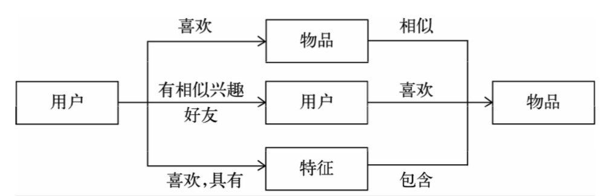
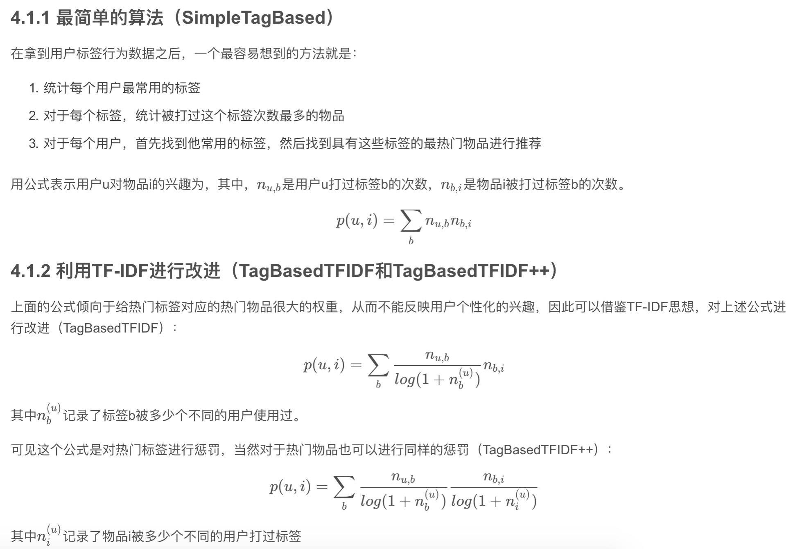
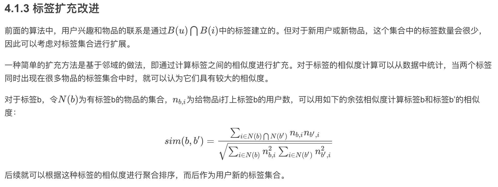
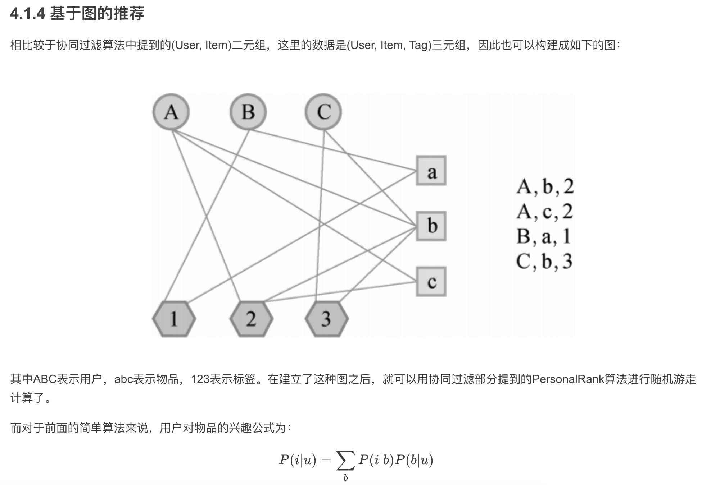
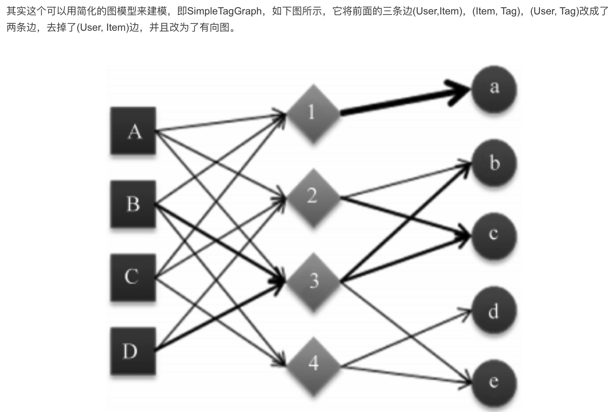
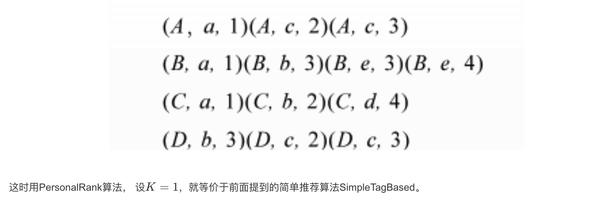
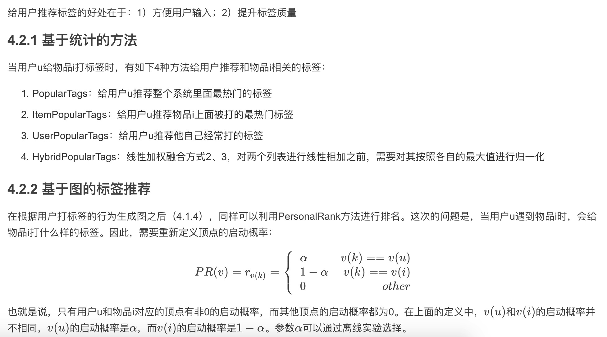

推荐系统的目的是联系用户的兴趣和物品，这种联系需要依赖不同的媒介。
- 第一种方式是**利用用户喜欢过的物品，给用户推荐与他喜欢过的物品相似的物品**，这就是前面提到的**基于物品的算法**
- 第二种方式是**利用和用户兴趣相似的其他用户，给用户推荐那些和他们兴趣爱好相似的其他用户喜欢的物品**，这是前面提到的**基于用户的算法**
- 第三种重要的方式是**通过一些特征(feature)联系用户和物品，给用户推荐那些具有用户喜欢的特征的物品**。这里的特征有不同的表现方式：
  - 可以表现为**物品的属性集合**(比如对于图书，属性集合包括作者、出版社、主题和关键词等)，
  - 也可以表现为**隐语义向量(latent factor vector)**，这可以通过前面提出的隐语义模型学习得到。

  
下面讨论一种重要的特征表现方式——标签。

# 4 利用用户标签数据

标签是一种无层次化结构的、用来描述信息的关键词，它可以用来描述物品的语义。**根据给物品打标签的人的不同**，标签应用一般分为两种:
- 一种是让作者或者专家给物品打标签;
- 另一种是让普通用户给物品打标签，也就是UGC(User Generated Content，用 户生成的内容)的标签应用。
  
UGC的标签系统是**一种表示用户兴趣和物品语义的重要方式。当一个用户对一个物品打上一个标签，这个标签一方面描述了用户的兴趣，另一方面则表示了物品的语义，从而将用户和物品联系了起来。**

下面主要讨论UGC的标签应用，**研究用户给物品打标签的行为，探讨如何通过分析这种行为给用户进行个性化推荐。**

## 标签系统中的推荐问题

打标签作为一种重要的用户行为，蕴含了很多用户兴趣信息，因此深入研究和利用用户打标签的行为可以很好地指导我们改进个性化推荐系统的推荐质量。同时，标签的表示形式非常简单， 便于很多算法处理。

标签系统中的推荐问题主要有以下两个。
 如何利用用户打标签的行为为其推荐物品(基于标签的推荐)?
 如何在用户给物品打标签时为其推荐适合该物品的标签(标签推荐)?

为了研究上面的两个问题，我们首先需要解答下面3个问题。 
 用户为什么要打标签?
 用户怎么打标签?
 用户打什么样的标签?

# 4 UGC推荐

用户的标签行为数据集一般由(u, i, b)三元组组成，表示用户u给物品i打上了标签b的行为。

## 4.1 基于用户UGC标签进行推荐

## 4.2 给用户推荐标签

