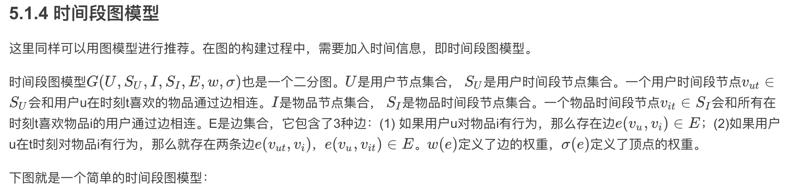

本章之前提到的推荐系统算法主要集中研究了如何联系用户兴趣和物品，将最符合用户兴趣的物品推荐给用户，但这些算法都忽略了一点，就是用户所处的上下文(context)。这些上下文包括用户访问推荐系统的时间、地点、心情等，对于提高推荐系统的推荐系统是非常重要的。比如，一个卖衣服的推荐系统在冬天和夏天应该给用户推荐不同种类的服装。推荐系统不能因为用户在夏天喜欢过某件T恤，就在冬天也给该用户推荐类似的T恤。再举个例子，当用户在中关村 打开一个美食推荐系统时，如果这个推荐系统推荐的餐馆都是中关村附近的，显然推荐结果更加能够令用户满意。上下文影响用户兴趣的例子还有很多，比如用户上班时和下班后的兴趣会有区别，用户在平时和周末的兴趣会有区别，用户和父母在一起与和同学在一起时的兴趣有区别，甚至用户在上厕所时阅读的文章和在办公桌旁阅读的文章也是不同的。因此，准确了解用户的上下文信息，并将该信息应用于推荐算法是设计好的推荐系统的关键步骤。

下面主要讨论时间上下文，并简单介绍一下地点上下文，讨论如何将时间信息和地点信息建模到推荐算法中，从而让推荐系统能够准确预测用户在某个特定时刻及特定地点的兴趣。本章仍然研究TopN推荐，即如何给用户生成一个长度为N的推荐列表，而该列表包含了用户在某一时刻或者某个地方最可能喜欢的物品。

# 5 上下文推荐

上下文的信息一般有时间、地点等。

## 5.1 时间上下文推荐

## 5.2 地点上下文推荐

地点上下文信息的出现方式有三种：
- 用户，用户位置，物品，评分
- 用户，物品，物品位置，评分
- 用户，用户位置，物品，物品位置，评分

