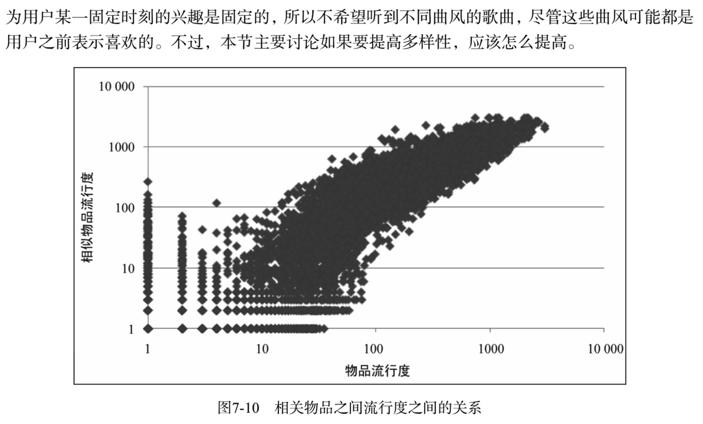

# 7 推荐系统实例

在实际系统中，前面几章提到的数据大都存在，因此如何设计一个真实的推荐系统处理不同的数据，根据不同的数据设计算法， 并将这些算法融合到一个系统当中是本章讨论的主要问题。

## 7.1 外围架构

图中表示了推荐系统和网站其他系统的关系。一般来说，每个网站都会有一个UI系统，UI系统负责给用户展示网页并和用户交互。网站会通过日志系统将用户在UI上的各种各样的行为记录到用户行为日志中。日志可能存储在内存缓存里，也可能存储在数据库中，也可能存储在文件系统中。而推荐系统通过分析用户的行为日志，给用户生成推荐列表，最终展示到网站的界面上。


从上面的结构可以看到，推荐系统要发挥强大的作用，除了推荐系统本身，主要还依赖于两个条件——**界面展示和用户行为数据**。关于如何设计推荐系统的界面，笔者没有太多的发言权。 不过，如果我们看看目前流行的推荐系统界面，可以看到这些界面都有一些共性。

- 通过一定方式展示物品，主要包括**物品的标题、缩略图和介绍等。**
- 很多推荐界面都提供了**推荐理由，理由可以增加用户对推荐结果的信任度。**
- 推荐界面**还需要提供一些按钮让用户对推荐结果进行反馈，这样才能让推荐算法不断改善用户的个性化推荐体验。**

在设计推荐界面时，我们可以综合考虑其他网站的设计并结合自己网站的特点。

### 数据收集和存储

个性化推荐算法依赖于用户行为数据，而在任何一个网站中都存在着各种各样的用户行为数据。那么如何存取这些数据就是推荐系统需要解决的首要问题。


按照前面数据的规模和是否需要实时存取，不同的行为数据将被存储在不同的媒介中。一般来说，需要实时存取的数据存储在数据库和缓存中，而大规模的非实时地存取数据存储在分布式文件系统(如HDFS)中。

数据能否实时存取在推荐系统中非常重要，因为推荐系统的实时性主要依赖于能否实时拿到用户的新行为。只有快速拿到大量用户的新行为，推荐系统才能够实时地适应用户当前的需求，给用户进行实时推荐。

## 7.2 推荐系统架构

前面提到推荐系统是联系用户和物品的媒介，而推荐系统联系用户和物品的方式主要有3种。如果将这3种方式都抽象一下就可以发现，如果认为用户喜欢的物品也是一种用
户特征，或者和用户兴趣相似的其他用户也是一种用户特征，那么用户就和物品通过特征相联系。


根据上面的抽象，可以设计一种基于特征的推荐系统架构。当用户到来之后， 推荐系统需要为用户生成特征，然后对每个特征找到和特征相关的物品，从而最终生成用户的推荐列表。因而，推荐系统的核心任务就被拆解成两部分，
- 一个是如何为给定用户生成特征；
- 另一个是如何根据特征找到物品。


用户的特征种类非常多，主要包括如下几类。
- 人口统计学特征包括用户的年龄、性别、国籍和民族等用户在注册时提供的信息。
- 用户的行为特征包括用户浏览过什么物品、收藏过什么物品、给什么物品打过什么样的分数等用户行为相关的特征。同时，用户行为从时间上也可以分为用户近期的行为和长期的行为。
- 用户的话题特征 可以根据用户的历史行为利用话题模型(topic model)将电视剧和电影聚合成不同的话题，并且计算出每个用户对什么话题感兴趣。比如用户如果看了《叶问》、《新龙门客栈》和《醉拳》，那么可以认为用户对“香港武侠电影”这个话题感兴趣。

推荐系统的推荐任务也有很多种，如下所示。
- 将最新加入的物品推荐给用户。
- 将商业上需要宣传的物品推荐给用户。
- 给用户推荐不同种类的物品，比如亚马逊会推荐图书、音像、电子产品和服装等
- 给用户混合推荐，有时需要将图书和音像制品放到一个推荐列表中展示给用户
- 对于不同的产品推荐不同新颖度的物品。比如在首页给用户展示比较热门的推荐结果， 在推荐系统页面给用户展示长尾中的物品
- 考虑到用户访问推荐系统的上下文，比如当你在豆瓣音乐找到“李宗盛”时，右侧会有一个链接告诉你可以在豆瓣电台收听“李宗盛”。单击了这个链接后，豆瓣电台给你推荐的音乐就考虑了“李宗盛”这个上下文

如果要在一个系统中把上面提到的各种特征和任务都统筹考虑，那么系统将会非常复杂，而且很难通过配置文件方便地配置不同特征和任务的权重。因此，**推荐系统需要由多个推荐引擎组成，每个推荐引擎负责一类特征和一种任务，而推荐系统的任务只是将推荐引擎的结果按照一定权重或者优先级合并、排序然后返回**


这样做还有两个好处。

- 可以方便地增加/删除引擎，控制不同引擎对推荐结果的影响。对于绝大多数需求，只需要通过不同的引擎组合实现。

- 可以实现推荐引擎级别的用户反馈。**每一个推荐引擎其实代表了一种推荐策略，而不同的用户可能喜欢不同的推荐策略**。有些用户可能喜欢利用他的年龄性别作出的推荐，有些用户可能比较喜欢看到新加入的和他兴趣相关的视频，有些用户喜欢比较新颖的推荐， 有些用户喜欢专注于一个邻域的推荐，有些用户喜欢多样的推荐。我们可以将每一种策略都设计成一个推荐引擎，然后通过分析用户对推荐结果的反馈了解用户比较喜欢哪些引擎推荐出来的结果，从而对不同的用户给出不同的引擎组合权重。**将推荐系统拆分成不同推荐引擎后，如何设计一个推荐引擎变成了推荐系统设计的核心部分。**

## 7.3 推荐引擎的架构

推荐引擎使用一种或几种用户特征，按照一种推荐策略生成一种类型物品的推荐列表。图中展示了每个具体推荐引擎的架构。

如图所示，推荐引擎架构主要包括3部分。
- 该部分负责从数据库或者缓存中拿到用户行为数据，**通过分析不同行为，生成当前用户的特征向量。不过如果是使用非行为特征，就不需要使用行为提取和分析模块了。该模块的输出是用户特征向量。**
- 该部分负责**将用户的特征向量通过特征-物品相关矩阵转化为初始推荐物品列表。**
- 该部分负责**对初始的推荐列表进行过滤、排名等处理，从而生成最终的推荐结果。**


### 7.3.1 生成用户特征向量

一般来说，用户的特征包括两种：
- 一种是用户的注册信息中可以提取出来的，主要包括用户的人口统计学特征。对于使用这种特征的推荐引擎，如果内存够，可以将存储这些特征的信息直接缓存在内存中，在推荐时直接拿到用户的特征数据并生成特征向量。除了这种特征，另一种特征主要是从用户的行为中计算出来的，本节**着重讨论如何生成特征。**
- **一个特征向量由特征以及特征的权重组成**，在利用用户行为计算特征向量时需要考虑以下因素。
  - **用户行为的种类**，在一个网站中，用户可以对物品产生很多不同种类的行为。用户可以浏览物品、单击物品的链接、收藏物品、给物品打分、购买物品、评论物品、给物品打上不同的标签、和好友分享物品、搜索不同的关键词等。这些行为都会对物品特征的权重产生影响，但不同行为的影响不同，大多时候很难确定什么行为更加重要，一般的标准就是用户付出代价越大的行为权重越高。比如，购买物品需要用户掏钱，所以用户一定会三思而后行，因此购买行为最为重要。相反，浏览物品的网页代价很小，所以这种行为对反映用户的真实兴趣的影响很小。
  - **用户行为产生的时间**，一般来说，用户近期的行为比较重要，而用户很久之前的行为相对比较次要。因此，如果用户最近购买过某一个物品，那么这个物品对应的特征将会具有比较高的权重。
  - **用户行为的次数**，有时用户对一个物品会产生很多次行为。比如用户会听一首歌很多次， 看一部电视剧的很多集等。因此用户对同一个物品的同一种行为发生的次数也反映了用户对物品的兴趣，行为次数多的物品对应的特征权重越高。
  - **物品的热门程度**，如果用户对一个很热门的物品产生了行为，往往不能代表用户的个性， 因为用户可能是在跟风，可能对该物品并没有太大兴趣，特别是在用户对一个热门物品 产生了偶尔几次不重要的行为(比如浏览行为)时，就更说明用户对这个物品可能没有什么兴趣，可能只是因为这个物品的链接到处都是，很容易点到而已。反之，如果用户对一个不热门的物品产生了行为，就说明了用户的个性需求。因此，推荐引擎在生成用户特征时会加重不热门物品对应的特征的权重。

### 7.3.2 特征—物品相关推荐

在得到用户的特征向量后，我们可以根据离线的相关表得到初始的物品推荐列表。离线相关表可以存储在MySQL中。


对于每个特征，我们可以在相关表中存储和它最相关的N个物品的ID。

一般来说，如果需要在一个小的候选物品集合中给用户推荐物品，那么可以考虑上述方法。 但如果是要在一个很大的候选物品集合中给用户推荐物品，那么可以考虑直接在初始推荐列表中过滤掉不在候选物品集合中物品的方法。

特征—物品相关推荐模块除了给用户返回物品推荐列表，还需要给推荐列表中的每个推荐结 果产生一个解释列表，表明这个物品是因为哪些特征推荐出来的。下面的代码给出了相关推荐模块的大体工作流程。

```python
def RecommendationCore(features, related_table):
        ret = dict()
        for fid, fweight in features.items()
             for item, sim in related_table[fid].items():
                 ret[item].weight += sim * fweight
                 ret[item].reason[fid] = sim * fweight
        return ret
```

### 7.3.3 过滤模块

在得到初步的推荐列表后，还不能把这个列表展现给用户，首先需要按照产品需求对结果进行过滤，过滤掉那些不符合要求的物品。一般来说，过滤模块会过滤掉以下物品。
- **用户已经产生过行为物品** 因为推荐系统的目的是帮助用户发现物品，因此没必要给用户推荐他已经知道的物品，这样可以保证推荐结果的新颖性。
- **候选物品以外的物品** 候选物品集合一般有两个来源，一个是产品需求。比如在首页可能要求将新加入的物品推荐给用户，因此需要在过滤模块中过滤掉不满足这一条件的物品。另一个来源是用户自己的选择，比如用户选择了某一个价格区间，只希望看到这个价格区间内的物品，那么过滤模块需要过滤掉不满足用户需求的物品。
- **某些质量很差的物品** 为了提高用户的体验，推荐系统需要给用户推荐质量好的物品， 那么对于一些绝大多数用户评论都很差的物品，推荐系统需要过滤掉。这种过滤一般以用户的历史评分为依据，比如过滤掉平均分在2分以下的物品。

### 7.3.4 排名模块

经过过滤后的推荐结果直接展示给用户一般也没有问题，但如果对它们进行一些排名，则可 以更好地提升用户满意度，一般排名模块需要包括很多不同的子模块，下面将对不同的模块分别加以介绍。

- 1. **新颖性排名** 
  新颖性排名模块的目的是给用户尽量推荐他们不知道的、长尾中的物品。虽然前面的过滤模


- 2. **多样性** 
  多样性也是推荐系统的重要指标之一。增加多样性可以让推荐结果覆盖尽可能多的用户兴趣。当然，这里需要指出的是提高多样性并不是时时刻刻都很好。比如在个性化网络电台中，因




```python
def ReasonDiversity(recommendations):
    reasons = set()
    for i in recommendations:
        if i.reason in reasons:
            i.weight /= 2
        reasons.add(i.reason)
    recommendations = sortByWeight(recommendations)
```

- 3. **时间多样性** 
  


- 4. **用户反馈**


点击模型需要离线计算好，在线将模型加载到内存中。为了提高在线预测的效率，一般只可以使用线性模型。