# 8 评分预测问题

到目前为止都是在讨论TopN推荐，即给定一个用户，如何给他生成一个长度为N的推荐 列表，使该推荐列表能够尽量满足用户的兴趣和需求。本书之所以如此重视TopN推荐，是因为它非常接近于满足实际系统的需求，实际系统绝大多数情况下就是给用户提供一个包括N个物品的个性化推荐列表。

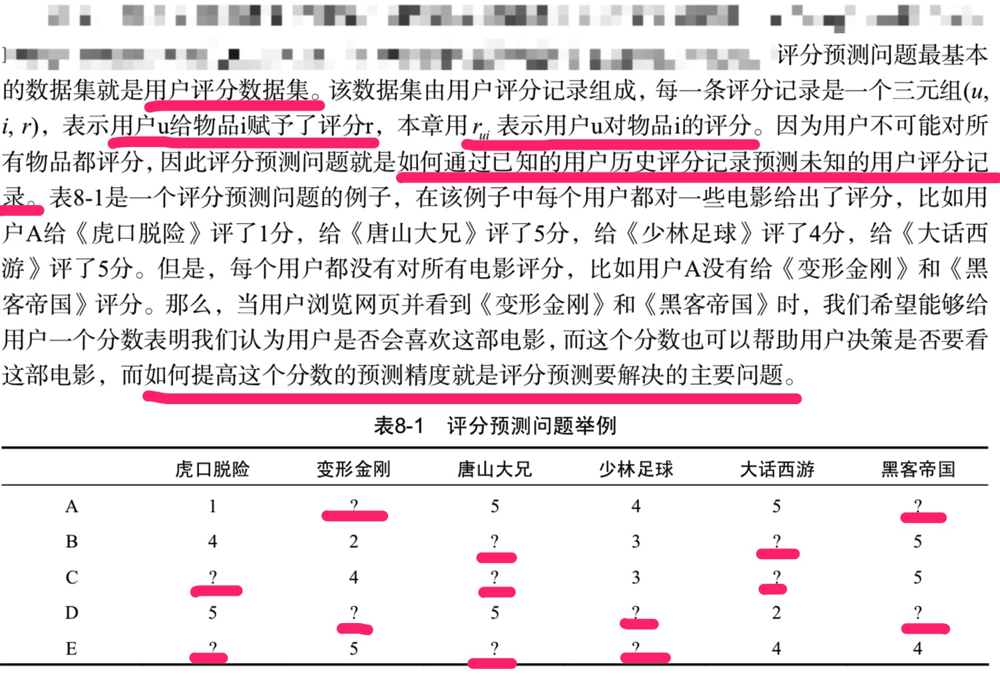

## 8.1 离线实验方法

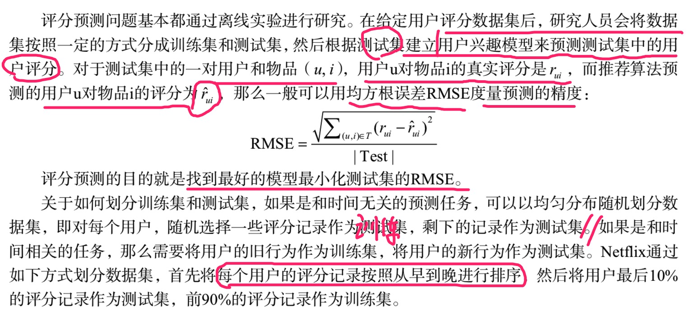

## 8.2 评分预测算法

### 8.2.1 平均值

最简单的评分预测算法是利用平均值预测用户对物品的评分。

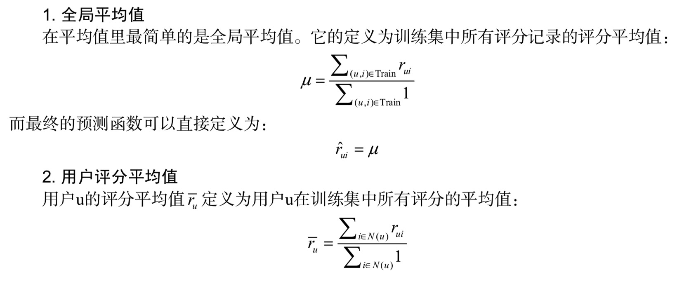

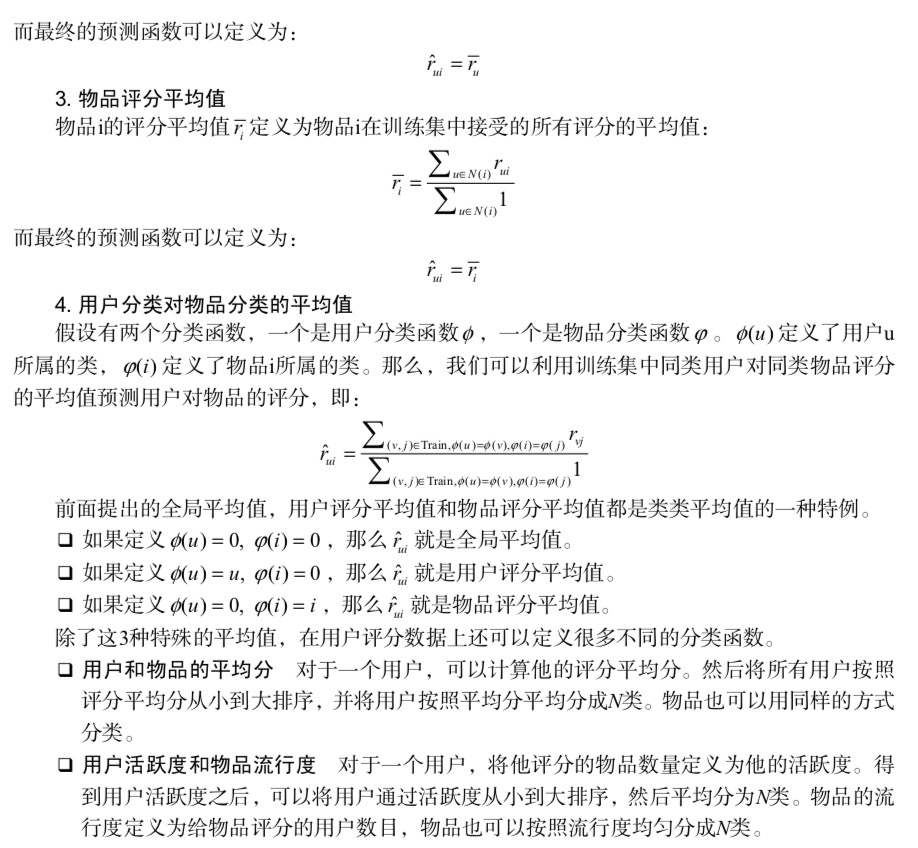

### 8.2.2 基于邻域的方法

基于用户的邻域算法和基于物品的邻域算法都可以应用到评分预测中。

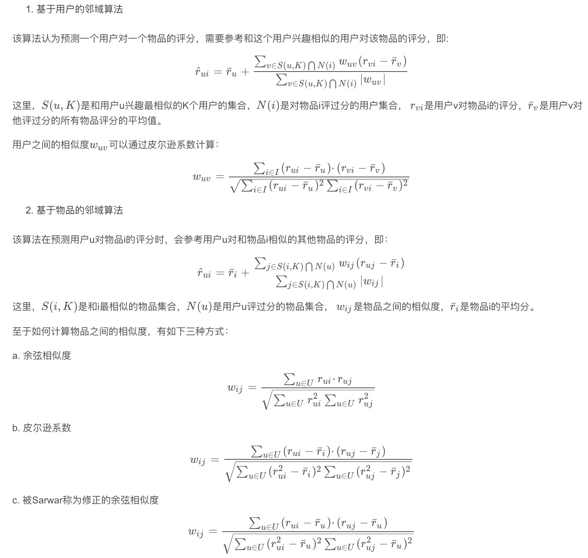

### 8.2.3 隐语义模型与矩阵分解模型

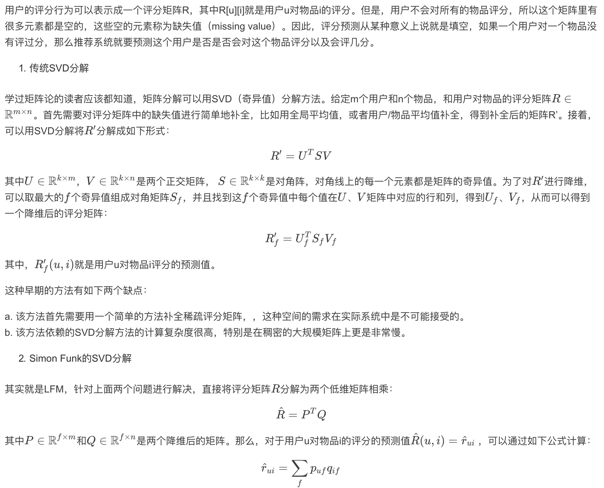

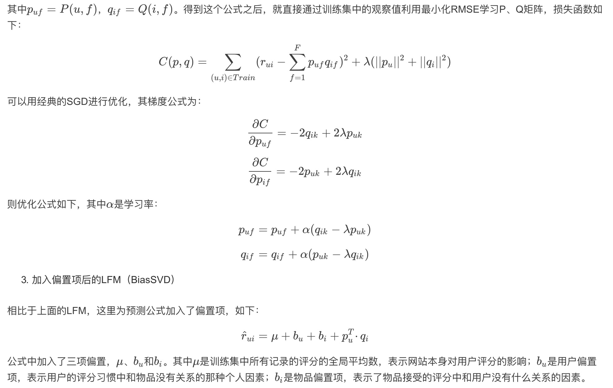

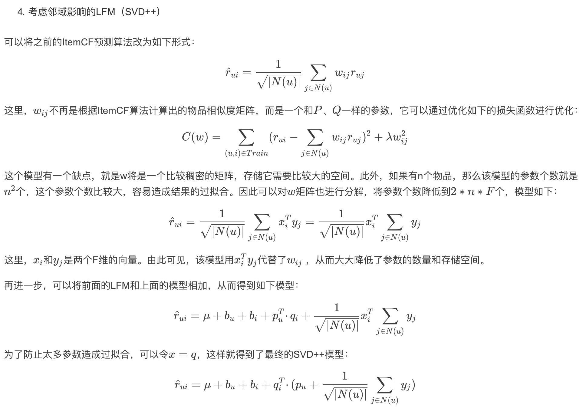

### 8.2.4 加入时间信息

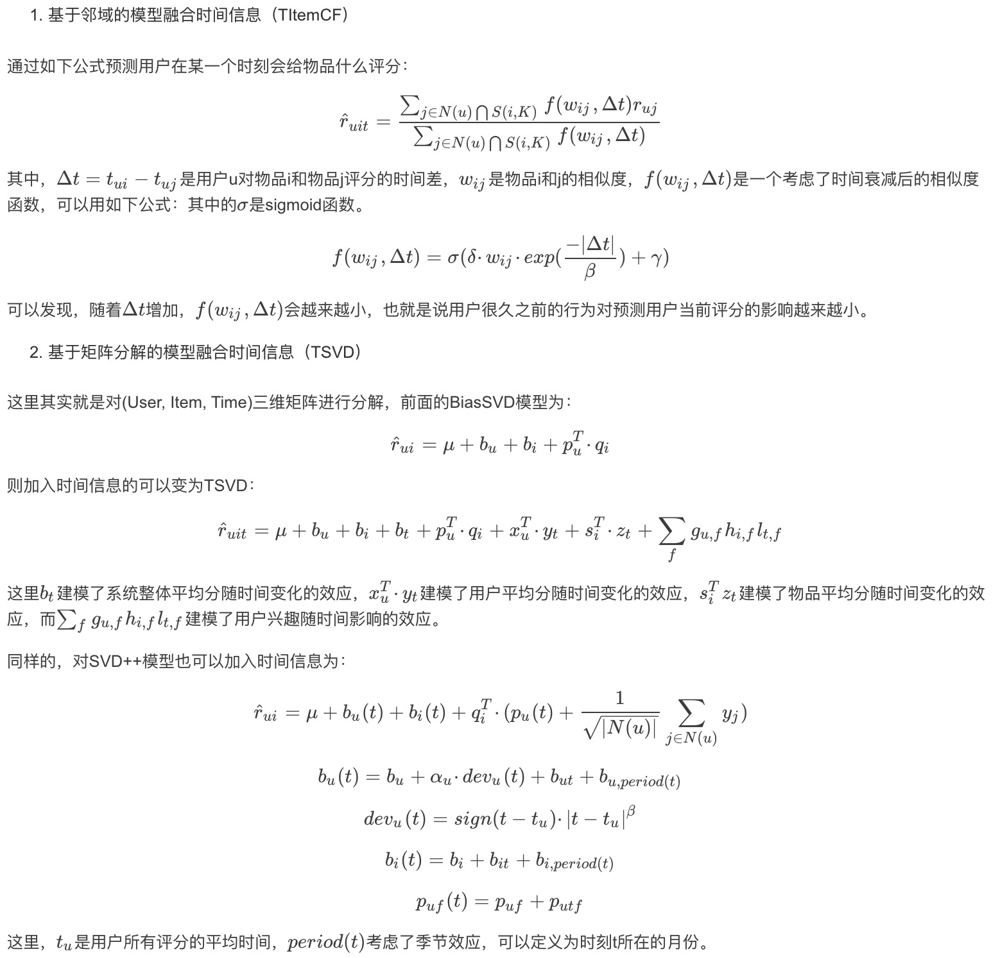

## 8.3 模型融合

一般模型融合都是数据比赛最后的大杀器。

### 8.3.1 级联融合

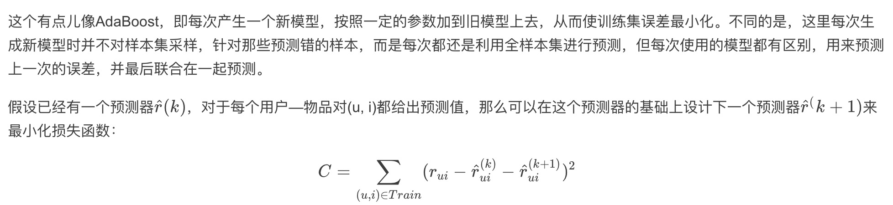

### 8.3.2 加权融合

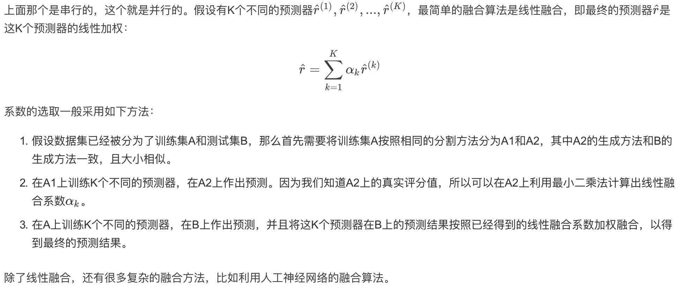

# 10条在设计推荐系统中学习到的经验和教训

- 确定你真的需要推荐系统。推荐系统只有在用户遇到信息过载时才必要。如果你的网站物品不太多，或者用户兴趣都比较单一，那么也许并不需要推荐系统。所以不要纠结于推荐系统这个词，不要为了做推荐系统而做推荐系统，而是应该从用户的角度出发，设计出能够真正帮助用户发现内容的系统，无论这个系统算法是否复杂，只要能够真正帮助用户，就是一个好的系统。

- 确定商业目标和用户满意度之间的关系。对用户好的推荐系统不代表商业上有用的推荐系统，因此要首先确定用户满意的推荐系统和商业上需求的差距。一般来说，有些时候用户满意和商业需求并不吻合。但是一般情况下，用户满意度总是符合企业的长期利益，因此这一条的主要观点是要平衡企业的长期利益和短期利益之间的关系。

- 选择合适的开发人员。一般来说，如果是一家大公司，应该雇用自己的开发人员来专门进行推荐系统的开发。

- 忘记冷启动的问题。不断地创新，互联网上有任何你想要的数据。只要用户喜欢你的产品，他们就会不断贡献新的数据。

- 平衡数据和算法之间的关系。使用正确的用户数据对推荐系统至关重要。对用户行为数据的深刻理解是设计好推荐系统的必要条件，因此分析数据是设计系统中最重要的部分。数据分析决定了如何设计模型，而算法只是决定了最终如何优化模型。

- 找到相关的物品很容易，但是何时以何种方式将它们展现给用户是很困难的。不要为了推荐而推荐。

- 不要浪费时间计算相似兴趣的用户，可以直接利用社会网络数据。 

- 需要不断地提升算法的扩展性。

- 选择合适的用户反馈方式。

- 设计合理的评测系统，时刻关注推荐系统各方面的性能。