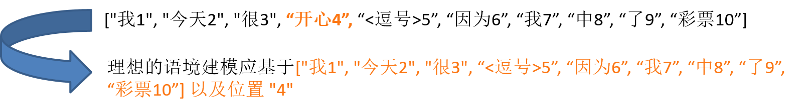
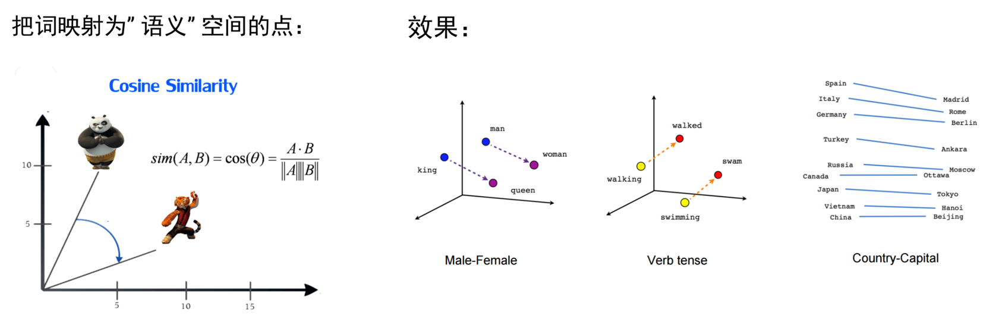
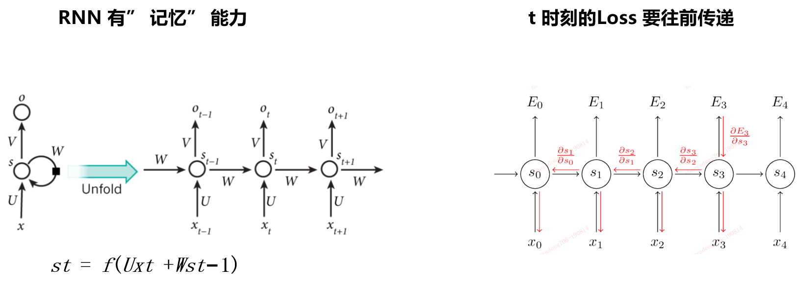
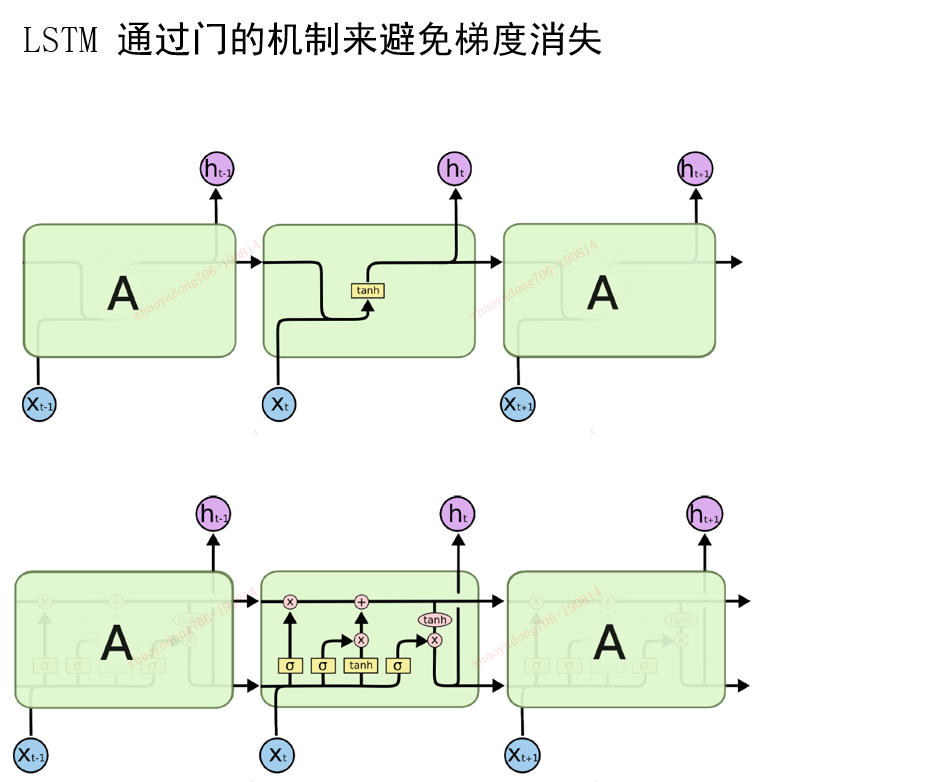
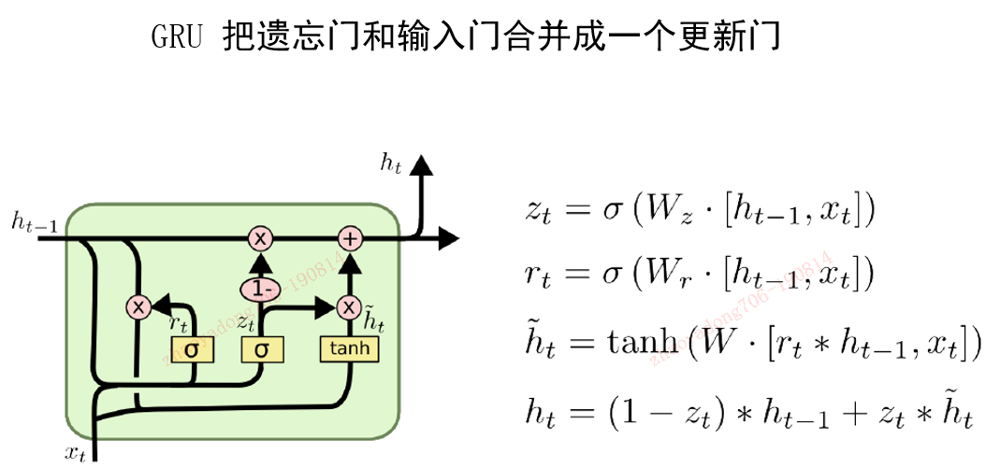
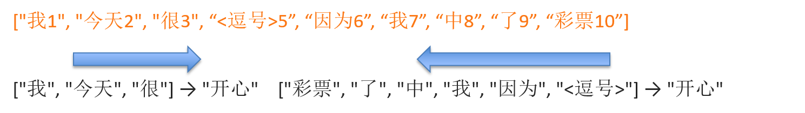
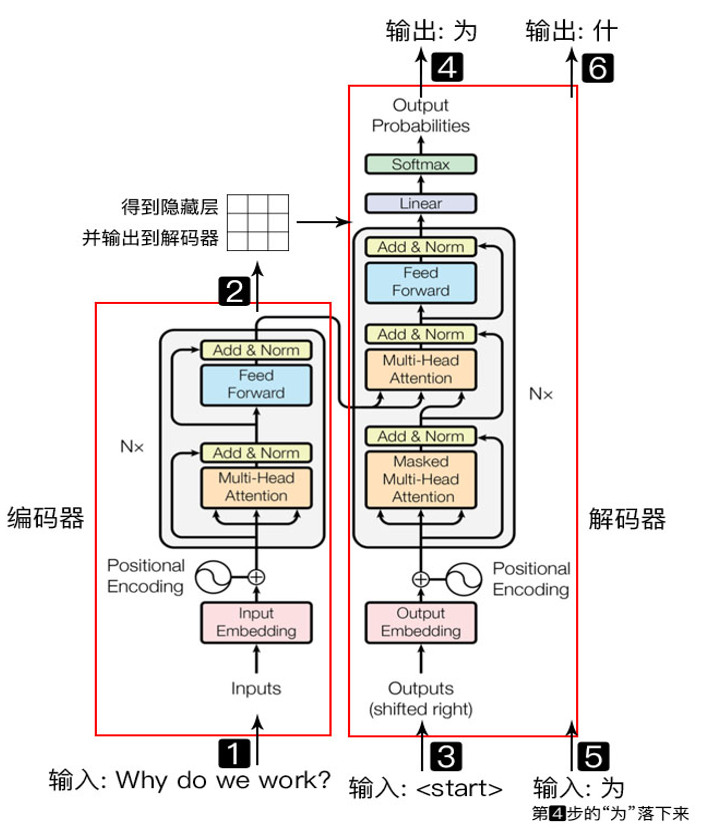
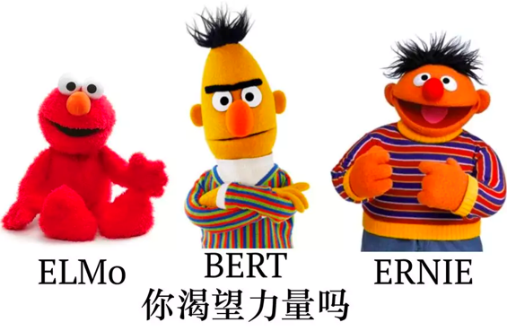
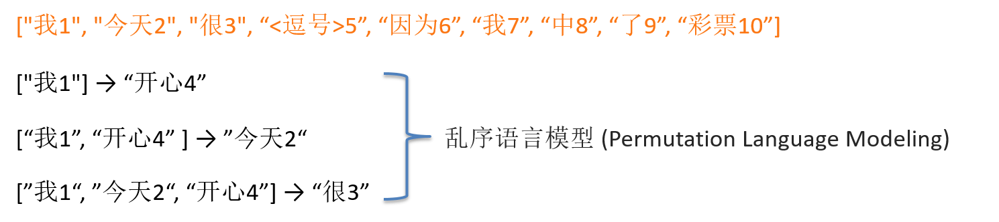
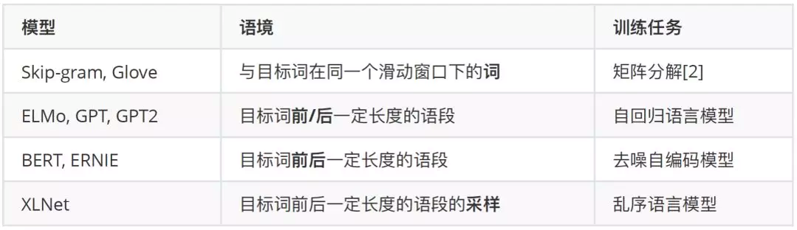

封面

# 1 什么是语言表征学习

- 深度学习的基本单元是向量。我们将建模对象对应到各自的向量 x (x{1}, x{2}, ..., x{n})，然后通过变换 (Transformation) 、整合 (Aggregation)得到新的向量 h，再基于向量 h 得到输出的判断 y。 h 就是我们说的表征 (Representation)，它是一个向量，描述了我们的建模对象。

- **语言表征学习**就是解决怎么样将一个词、一句话、一篇文章通过变换 (Transformation) 和整合 (Aggregation) 转化成对应的向量 h 的问题。

- 深度学习解决这个问题的办法是人工设计一个带有可调参数的模型，通过指定一系列的 (输入→输出) 对 (x → y)，让模型学习得到最优的参数。当参数确定之后，模型除了可以完成从 x 预测 y 的任务之外，其中间把 x 变换成 h 的方法也是可以用到其他任务的。这也是我们为什么要做表征学习。就是说**我们在做预测任务的同时，顺便把表征学习给做一并做了**。

那么接下来的问题就是：

- 怎么确定 (输入→输出) 对，即模型的预测任务

- 这个模型怎么设计

# 2 分布式语义假设

- 任何任务都可以用来做表征学习：情感分析 (输入句子，判断句子是正向情感还是负向情感)，机器翻译 (输入中文，输出英文)。但是这些任务的缺点是需要大量的人工标注，这些标注耗时耗力。当标注量不够时，模型很容易学出“三长一短选最短”的取巧方案。

- 分布式语义假设 (Distributional Hypothesis)：**我们可以通过一个词出现的语境知道这个词的意思。**

- 我们可以将输入 x 定为目标词的语境，输出 y 定为目标词。这个任务的优点是**我们并不需要人工标注的数据，只需要许多有意义的语段就可以了**。

**貌似，现在很多大厂就是这么操作的。。。**

如何更精细地建模语境，得到其对应的表征向量 h？对这个问题的解答贯穿了语言表征学习的发展历程。我们希望能够做到：

- **语境要包含所有区分目标词的信息**

- **建模语境中词的相互依赖关系（在大部分语言中，词的相对位置也决定了词间的依赖关系）**

# 3 预训练词向量(Word Embedding)

预训练词向量(Word Embedding)的方法如 Word2Vec, Glove 等是语言表征学习的主要手段。由于缺乏有效建模词的相互依赖的手段，我们使用**目标词前后的窗口内的词作为目标词的语境词(Context Word)，每个词都有一个唯一独立的向量作为其表征**。

**但是，对于“一词多义”的问题，Word2Vec等模型似乎很难解决。。。**

例如，下面的问题：同样都是“加贺号护卫舰”，Word2Vec等方法认为他们都是一样的，但实际上他们是不一样的事物。

# 4 循环神经网络(RNN/LSTM/GRU)

用一个向量代表一个词在预训练词向量流行之后已经变成标准做法，这也是我们用上神经网络模型组件的基础。

如图所示，例如：我们可以按照一个顺序 (从左到右) 对上述向量序列编号: [x{1}, x{2}, x{q3}, ..., x{t-1}, x{t}, x{t+1},…] **按照编号的顺序**，在第 t 位时，**循环神经网络会根据第 t-1 位的表征 s{t-1} 及当前的输入 x{t} 算出当前位置的表征 s{t}**, 这便是序列 [x{1}, x{2}, ..., x{t}] 对应的表征。可以看到**输入向量的相对位置决定了循环神经网络整合信息的计算顺序。**

但是，原始的RNN会出现梯度消失等问题，所以还来才有了LSTM和GRU等模型。

LSTM和GRU模型是虽然很好的解决了语境中长短期依赖问题，但是，**由于顺序依赖性，难以做到并行化计算，制约了其应用性**。

# 5 自回归语言模型

在拥有循环神经网络这一序列建模利器之后，我们可以对语境进行更精细的建模。由于 RNN 的运算模式是按顺序依次处理每个词，所以语境可以是目标词前面的所有词。

如上图所示，因为**目标词总是语境的下一个词，所以我们并不需要输入目标词的位置信息。而词的相对位置决定了词的输入顺序，所以词的位置也不再需要输入了。**

**自回归语言模型的优点是计算效率比较高**。我们只要对["我1", "今天2", "很3", “开心4”, “<逗号>5”, “因为6”, “我7”, “中8”, “了9”, “彩票10”] 这句话做一次表征计算，便可以得到许多输入输出对的语境表征：(["我"] → "今天")，(["我", "今天"]→ "很")，(["我", "今天", "很"] → "开心") 等等。

自回归语言模型也是自然语言生成的标准方案：

- 一个句子的生成可以转化成以前面的片段为语境，预测下一个词的任务。

- **新预测的词可以拼接到已经生成的片段，作为预测下一个词所依据的语境。**

- 由于可以对语境进行建模，**预训练词表征便可以从语境无关的词向量变成基于语境的词表征 (Contextual Representation)。**

- 但**这种语境建模方式只使用了目标词左边 (右边) 单方向的所有词，所以预测任务仍然会存在歧义。**

# 6 Transformer

**双向语境的建模困难主要源于循环神经网络单向、顺序的计算方式。**

除了限制依赖关系的方向之外，这种计算方式也限制了循环神经网络能建模的最大依赖距离。例如：x{1} 和 x{300} 的间依赖关系需要通过重复计算 300 次 才能求得。而由于循环神经网络中存在矩阵乘法，在计算 x{300} 时 x{1} 的信息被相同的矩阵乘了 300 次。由于矩阵 W{h} 的模不同，会导致信息的爆炸 (|W{h}|>1) 或者消失 (|W{h}|<1)等问题。

**我们既要取得双向依赖建模，又要让长距离的依赖中间间隔的计算操作尽可能的少。**
Transformer 的提出实现了以下几个目的：
- 层归一化 (Layer Normalization)
- **多注意力算子 (Multi-Head Self-Attention)**
- **位置编码（Positional Encoding ）**

Transformer和LSTM的最大区别, 就是LSTM的训练是迭代的, 是一个接一个字的来, 当前这个字过完LSTM单元, 才可以进下一个字, 而Transformer的训练是并行了, 就是所有字是全部同时训练的, 这样就大大加快了计算效率, Transformer使用了位置嵌入来理解语言的顺序, 使用自注意力机制和全连接层来进行计算。

如图所示，Transformer模型主要分为两大部分, 分别是编码器和解码器, 编码器负责把自然语言序列映射成为隐藏层(下图中第2步用九宫格比喻的部分), 含有自然语言序列的数学表达. 然后解码器把隐藏层再映射为自然语言序列, 从而使我们可以解决各种问题, 如情感分类, 命名实体识别, 语义关系抽取, 摘要生成, 机器翻译等等, 下面我们简单说一下图中的每一步都做了什么:

- 输入自然语言序列到编码器: Why do we work?(为什么要工作);
- 编码器输出的隐藏层, 再输入到解码器;
- 输入(起始)符号到解码器;
- 得到第一个字"为";
- 将得到的第一个字"为"落下来再输入到解码器;
- 得到第二个字"什";
- 将得到的第二字再落下来, 直到解码器输出(终止符), 即序列生成完成.

# 7 去噪自编码模型/掩码语言模型

加入 Transformer 后，我们的军火库多了建模双向语境的武器。但是如前所述，**自注意力算子构建的是第 i 个词基于语境的表征，使用这个表征来预测第 i 个词会带来标签泄露。** 这就好比在给你出题的时候顺便直白地告诉了你答案。

**我们既想用上 Transformer 的建模能力，又想从第 i 个词的表征中剔除这个词的信息。** 以 BERT 为代表的去噪自编码模型 (Denoising Auto-Encoder)/掩码语言模型 (Masked Language Modeling) 的做法是将这些词替换成特殊字符 "MASK"。

虽然结合 Transformer 和去噪自编码模型的 BERT 可以说是拿到了语境建模的“双向圣杯”。**但是，BERT 中 “MASK” 字符的加入，使得非目标词表征的建模都会依赖于人造的 “MASK” 字符，这会使模型学出虚假的依赖关系 (比如 “MASK” 可以作为不同词信息交换的桥梁)** ，但 "MASK" 在下游任务中并不会出现。

# 8 乱序语言模型

**BERT 虽然充分地建模了双向语境信息**，但是其用来**预测不同目标词的语境信息只有目标位置编码的区别，同时也建模不了被替换成 "MASK" 的词间的依赖关系。**

**自回归语言模型虽然只能建模单向的语境，但是其计算效率比较高**，且预测每个词所用的语境都是不一样的。怎么把这两者的长处结合呢？

语境中的词之间的相互依赖关系，**一是取决于词本身的性质，二是取决于语境中词的相对位置。** 所以有了词以及词在语境中的位置，我们就有了从这个词构建依赖关系的全部信息。

如图所示，和**自回归语言模型**不一样，**新的样本中的语境需要输入词的位置，否则就退化成了词带模型 (Bag of Words)。**  这可以类比到人的阅读方式：**字词在书本上的位置是一定的，但从左到右的阅读顺序并不是强制的，我们还可以跳读。乱序语言模型是自回归语言模型的一种推广。**

## 乱序语言模型的代表作————XLNet

[XLNet: Generalized Autoregressive Pretraining for Language Understanding](https://arxiv.org/abs/1906.08237)

- **乱序语言模型的语境可以同时来自目标词的前向和后向**，所以其建模了双向的依赖。每个被预测的词 (除最后一个词外) 都会加入到语境中，所以**既解决了 BERT 忽略被替换的词间的依赖关系的问题，又解决了 BERT 不同目标词依赖的语境趋同的问题。**

- 相比于 BERT 一次性输入几乎所有的语境信息，**乱序语言模型可以认为是对双向语境进行了采样 (或者 Embedding Dropout)，这会产生类似于 Dropout 效果，可以让模型学出更鲁棒的语境依赖。**

- **当构成语境的词比较少时，根据语境预测目标词的歧义性就会增大，训练难度也会增大。**

XLNet 的成功来自于三点：

- 分布式语义假设的有效性，即我们确实**可以从语料的统计规律中习得常识及语言的结构。**

- **对语境更加精细的建模：从"单向"语境到"双向"语境，从"短程"依赖到"长程"依赖**，XLNet 是目前对语境建模最精细的模型。

- 在模型容量足够大时，数据量的对数和性能提升在一定范围内接近正比 ，**XLNet 使用的预训练数据量可能是公开模型里面最大的。**

# 9 基于Transformer的应用

# 10 总结

可以预见的是资源丰富的大厂（Google,百度）可以闭着眼睛继续顺着 **“更多数据量，更大模型”** 的方向前进，或许还能造出些大新闻出来。但是，为了达到足够大的模型容量，我们真的需要这么大的计算量吗？已经有工作证明训练充分的 Transformer 里面存在很多重复冗余的模块。除了把网络加深加宽外，我们还有什么办法去增大模型容量的同时，保持一定的计算量？这些都是值得研究者深刻思考的问题。**对语境的更精细建模自然是继续发展的道路，以语言模型为代表的预训练任务和下游任务之间的关系也是非常值得我们关注的问题。**