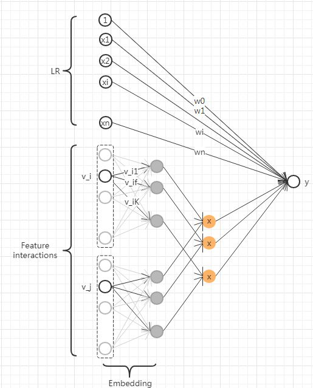
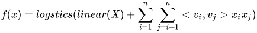
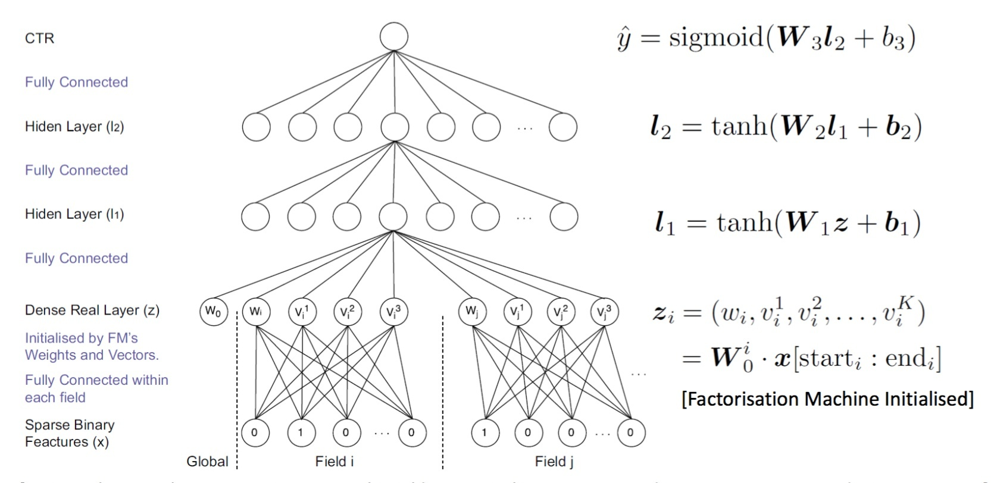
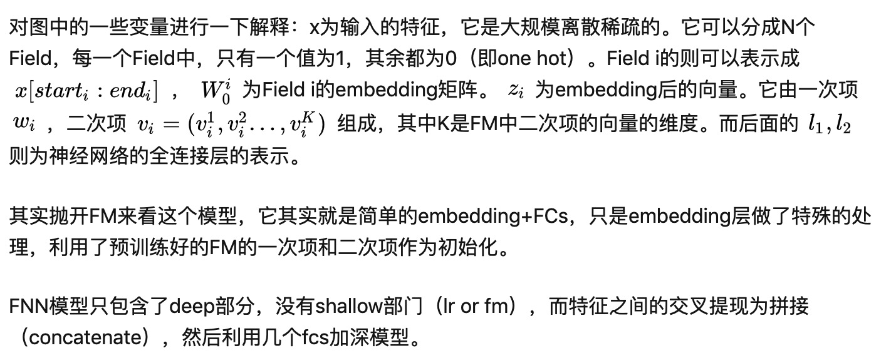
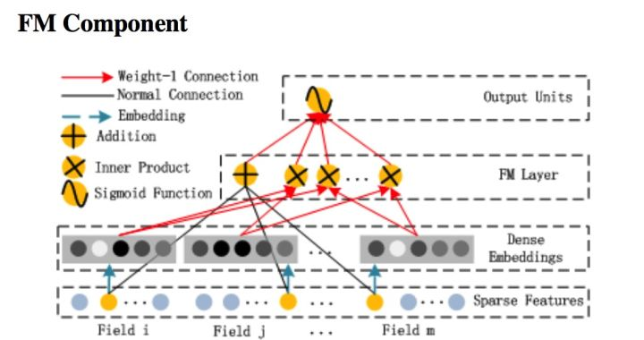
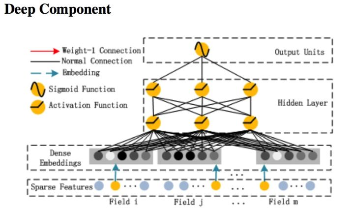
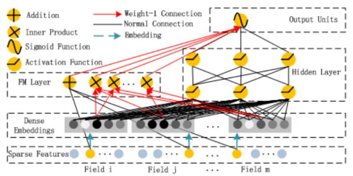

# 传统模型

## 一. 什么是ctr？

ctr即点击率，在推荐系统中，通常是按照ctr来对召回的内容子集进行排序，然后再结合策略进行内容的分发。

## 二. ctr预估模型的发展。

ctr预估模型的公式：y = f(x)， y的范围为[0,1]，表示广告被点击的概率。

### 1. LR 海量高纬离散特征

LR（logistics regression），是ctr预估模型的最基本的模型，也是工业界最喜爱使用的方案。LR的介绍这里就不细说了，介绍的教程随便一搜一大堆。

此时， $$
f(x)=\frac{1}{1+e^{-\theta^{T} X}}
$$，其中 $$
\theta=\left(\theta_{0}, \theta_{1}, \theta_{2} \ldots \theta_{n}\right)
$$

这里，我们定义一下, $$
\operatorname{logsitcs}(x)=\frac{1}{1+e^{-x}}, \text { linear }(x)=\theta^{T} X
$$
则： 
$$
f(x)=\operatorname{logistics}(\operatorname{linear}(X))
$$

LR的优势在于处理离散化特征，而且模型十分简单，很容易实现分布式计算。关于LR的变种也有许多，比如Google的FTRL，其实这些变种都可以看成：LR+正则化+特定优化方法。

LR的缺点也很明显，特征与特征之间在模型中是独立的，对于一些存在交叉可能性的特征（比如: 衣服类型与性别，这两个特征交叉很有意义），需要进行大量的人工特征工程进行交叉。虽然模型简单了，但是人工的工作却繁重了很多。而且LR需要将特征进行离散化，归一化，在离散化过程中也可能出现边界问题。这里便为GBDT+LR的方案进行了铺垫。

### 2. GBDT

GBDT，即梯度提升决策树，是一种表达能力比较强的非线性模型。具体模型的介绍，也可以google出一堆教程。所以这里就不做详细的推导了。

此时，$$
f(x)=\operatorname{logstics}\left(g b d t_{-} \operatorname{tree}_{1}(X)+g b d t_{-} \operatorname{tree}_{2}(X)+g b d t_{-} \operatorname{tree}_{3}(X) \ldots\right)
$$

GBDT的优势在于处理连续值特征，比如用户历史点击率，用户历史浏览次数等连续值特征。而且由于树的分裂算法，它具有一定的组合特征的能力，模型的表达能力要比LR强。GBDT对特征的数值线性变化不敏感，它会按照目标函数，自动选择最优的分裂特征和该特征的最优分裂点，而且根据特征的分裂次数，还可以得到一个特征的重要性排序。所以，使用GBDT减少人工特征工程的工作量和进行特征筛选。

GBDT善于处理连续值特征，但是推荐系统的绝大多数场景中，出现的都是大规模离散化特征，如果我们需要使用GBDT的话，则需要将很多特征统计成连续值特征（或者embedding），这里可能需要耗费比较多的时间。同时，因为GBDT模型特点，它具有很强的记忆行为，不利于挖掘长尾特征，而且GBDT虽然具备一定的组合特征的能力，但是组合的能力十分有限，远不能与dnn相比。

### 3. FM与FFM

在LR部分，我们提及到了LR不能自动处理交叉特征。而FM则是在这个基础上进改进。

FM的模型公式为:

$$
f(x)=\operatorname{logstics}\left(\operatorname{linear}(X)+\sum_{i=1}^{n} \sum_{j=i+1}^{n} w_{i j} x_{i} x_{j}\right)
$$

在逻辑斯特函数里面的公式可以看成两部分，一部分是我们所熟悉的线性回归函数，而第二部分则是二次交叉项。所以FM处理特征间二次交叉的能力。

但是二次项权重 \(w_{i j}\) 需要我们去存储一个二维矩阵的变量，而因为特征是大规模离散的，这个二维矩阵的维度可能很大。而FM的作者利用矩阵分解的原理，将这个权重矩阵进行分解，即 \(w_{i j}=<v_{i}, v_{j}>\)。

则FM的公式变为：

$$
f(x)=\operatorname{logstics}\left(\operatorname{linear}(X)+\sum_{i=1}^{n} \sum_{j=i+1}^{n}<v_{i}, v_{j}>x_{i} x_{j}\right)
$$

FFM的模型公式为：

$$
f(x)=\operatorname{logstics}\left(\operatorname{linear}(X)+\sum_{i=1}^{n} \sum_{j=i+1}^{n}<v_{i f_{j}}, v_{j f_{i}}>x_{i} x_{j}\right)
$$

FM的优点相对于LR在于拥有处理二次交叉特征的能力，而且它是可以实现线性的时间复杂度的，模型训练也十分快。

而FFM则是在FM的基础上，考虑了特征交叉的field的特点，但是也导致它没有办法实现线性的时间复杂度，模型训练要比FM慢一个量级，但是效果会比FM来得更好。

### 4. GBDT+(LR, FM, FFM)

前面提及到了GBDT适合处理连续值特征，而LR，FM，FFM更加适合处理离散化特征。GBDT可以做到一定程度的特征组合，而且GBDT的特征组合是多次组合的，不仅仅是FM与FFM这样的二阶组合而已。同时，GBDT具备一定的特征选择能力（选择最优的特征进行分裂）。

在facebook 2014年的一篇论文中，提及到GBDT+LR的解决方案。即先使用GBDT对一些稠密的特征进行特征选择，得到的叶子节点，再拼接离散化特征放进去LR进行训练。在方案可以看成，利用GBDT替代人工实现连续值特征的离散化，而且同时在一定程度组合了特征，可以改善人工离散化中可能出现的边界问题，也减少了人工的工作量。

而kaggle的ctr预估比赛中，台大的团队参考fb,使用了gbdt+ffm的方案夺冠。

此时GBDT+LR模型的公式为：
$$
X_{n e w}=X+g b d t(x)^{\prime} s \text { nodes }
$$

$$
f(x)=\operatorname{logistics}\left(\text {linear }\left(X_{\text {new}}\right)\right)
$$

### 5. MLR

MLR是由阿里团队提出的一种非线性模型。它等价于聚类+LR的形式。

我们定义：

$$
\operatorname{softmax}(X, i, m)=\frac{e^{\mu_{i} X}}{\sum_{j=1}^{m} e^{\mu_{j} X}}
$$

则MLR的公式为：

$$
f(x)=\sum_{i=1}^{m} \operatorname{softmax}(X, i, m) * \operatorname{logistics}(\operatorname{linear}(X))
$$

相当于将X进行聚类，聚成m类，然后每一个聚类单独训练一个LR。

MLR相对于LR拥有更好的非线性表达能力，算是LR的一种拓展。

但是MLR与LR一样，也需要较大的特征工程处理，而且这个模型本身属于非凸模型，需要预训练，可能出现不收敛的情况。

---
---
---

# FNN模型

## 一.FM的神经网络形式

在推荐系统中使用ctr排序的f(x)的设计-传统模型篇中，我曾提及到了FM与FFM。其实FM与FFM都是可以从神经网络的角度进行理解的。

FM的神经网络模型图

如上图所示，FM公式：

可以看成一个三层的神经网络。后面的二次项，可以看成神经网络embedding后，然后每两个向量做内积。

## 二. FNN的神经网络结构

FNN，Factorisation-machine supported Neural Networks，是较早期的一种使用神经网络解决ctr预估问题的一种模型。其结构图如下所示。

FNN的神经网络结构图

---
---
---

# DeepFM

## 一. FM与DEEP Network的网络结构

在讲述deep fm之前，我们先从神经网络的角度来回顾一下FM与最简单的深度神经网络。

FM模型的网络结构图

DEEP Network的网络结构

如图所示，FM是一个简单的三层网络，它的核心部分是第二层的FM layer，FM layer由两部分组成，一部分是lr部分，令一部分是inner product部分。图中的红色箭头代表权重为1的连接，是不更新的(在实际的代码实现中不需要管，直接内积或者求和就好，这里只是为了更加直观地从神经网络的角度了解FM)。

而Deep network，则是一个简单的embedding+fcs，不需要过多讲解。

DeepFM模型其实就是将这两个模型组合起来了。

## 二. DeepFM模型的网络结构

DeepFM的网络结构图

DeepFM的结构。其实它就是将FM和deep network结合起来了，而inner product和deep network中的第一个全连接层共用embedding层输出的结果作为自己的输入。

从比较宏观的角度看待deepfm模型，它是由**shallow part: FM和deep part: fcs组合而成。值得注意的是权重为1的线。**

而其**提现特征交叉的方式主要提现在FM本身自带的二阶特征交叉，还有concatenate(拼接)后接fcs。所以理论上，它是比fm的表达能力更强，可以挖掘更高阶的特征交叉。**