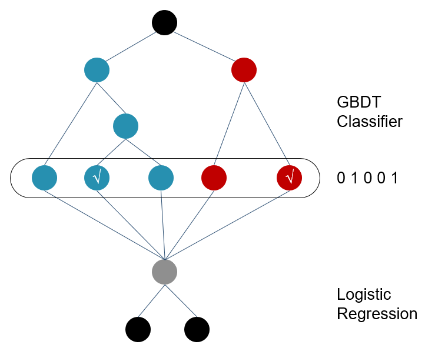
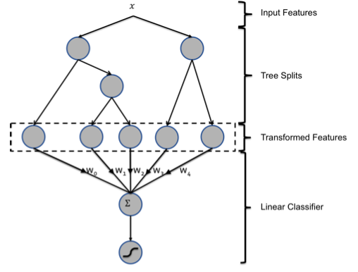

- LR, FM都比较适用于高维稀疏特征, gbdt不适合. 

- FM能够得到特征分量之间的关系(通常是两两特征), LR常用于线性问题，对于非线性问题需要定义非线性函数对特征进行映射, GBDT对线性/非线性问题基本上都通吃，而且效果很好. 

- **要想取得好的效果，建议gbdt+LR或者gbdt+FM**, **即gbdt的输出作为LR或者FM的输入**, **原始特征经过gbdt转变成高维稀疏特征**, gbdt的输出相当于**对原始特征进行了特征组合得到高阶属性或者说是非线性映射。**

**高维稀疏特征的时候，LR的效果会比GBDT好，但是都没明确的说出为什么?**

举个例子：

假设有1w个样本，y类别0和1，100维特征，其中10个样本都是类别1，而特征f1的值为0，1，且刚好这10个样本的f1特征值都为1，其余9990样本都为0（在高维稀疏的情况下这种情况很常见),我们都知道这种情况在树模型的时候，很容易优化出含一个使用f1为分裂节点的树直接将数据划分的很好，但是当测试的时候，却会发现效果很差，因为这个特征只是刚好偶然间跟y拟合到了这个规律，这也是我们常说的过拟合。但是当时我还是不太懂为什么线性模型就能对这种case处理的好？照理说线性模型在优化之后不也会产生这样一个式子：
$$
y=W 1 * f 1+W i^{*} f i+\ldots
$$
，其中W1特别大以拟合这十个样本吗，因为反正f1的值只有0和1，W1过大对其他9990样本不会有任何影响。后来思考后发现原因是因为 **现在的模型普遍都会带着正则项，而lr等线性模型的正则项是对权重的惩罚，也就是W1一旦过大，惩罚就会很大，进一步压缩W1的值，使他不至于过大。** 而**树模型则不一样，树模型的惩罚项通常为叶子节点数和深度等，而我们都知道，对于上面这种case，树只需要一个节点就可以完美分割9990和10个样本，惩罚项极其之小，这也就是为什么在高维稀疏特征的时候，线性模型会比非线性模型好的原因了**：**带正则化的线性模型比较不容易对稀疏特征过拟合**

一、特征适用
- 1、gbdt模型是**非线性模型**，可以输入统计类特征，特征维度一般几十到几百维。统计类特捕捉的是影响最终效果的总体或者说全局性的因素。曾看到过腾讯技术博客里给gbdt模型输入海量特征，但个人感觉**gbdt不适合海量特征，因为一方面可能只有较少特征有作为划分特征的机会，另一方面每次选择划分属性时所有特征都考虑的话性能会很差。**
- 2、LR模型属于**线性模型**。模型简单，可以引入**海量离散特征**。这样的好处就是**模型可以考虑更加细节或者说针对具体个体的因素**。如果想要引入非线性因素需要做特征交叉，这样很容易产生百亿特征，在很早之前ctr就主要靠堆人力搞特征工程工作来持续优化效果。
- 3、FM模型也属于**线性模型，**不过可以**在模型里用隐向量乘积模拟特征交叉，比LR模型手动撸交叉特征工程明显要elegant一些**。由于复杂度的原因，较为常见的只有二阶交叉。 

二、常用套路

**针对在工业界的经验，先根据业务场景做提取统计类特征使用gbdt模型快速拿到收益，然后考虑加入海量离散类特征（比如个性化因素等），使用LR/FM模型进一步提升效果**。**至于原有的统计类特征可以通过gbdt叶子节点转换成离散特征一并加入到LR/FM中**。

# 写在前面的话

GBDT和LR的融合在广告点击率预估中算是发展比较早的算法，为什么会在这里写这么一篇呢？本来想尝试写一下**阿里的深度兴趣网络(Deep Interest Network)，发现阿里之前还有一个算法MLR**，然后去查找相关的资料，里面提及了树模型也就是GBDT+LR方案的缺点，恰好之前也不太清楚GBDT+LR到底是怎么做的，所以今天我们先来了解一下GBDT和LR的融合方案。

GBDT+LR 使用最广泛的场景是CTR点击率预估，即预测当给用户推送的广告会不会被用户点击。

点击率预估模型涉及的训练样本一般是上亿级别，样本量大，模型常采用速度较快的LR。但LR是线性模型，学习能力有限，此时特征工程尤其重要。现有的特征工程实验，主要集中在寻找到有区分度的特征、特征组合，折腾一圈未必会带来效果提升。GBDT算法的特点正好可以用来发掘有区分度的特征、特征组合，减少特征工程中人力成本。

关于CTR的流程，如下图所示：

如上图，主要包括两大部分：**离线部分、在线部分，其中离线部分目标主要是训练出可用模型，而在线部分则考虑模型上线后，性能可能随时间而出现下降，弱出现这种情况，可选择使用Online-Learning来在线更新模型**：

## 离线部分

- 数据收集：主要收集和业务相关的数据，通常会有专门的同事在app位置进行埋点，拿到业务数据
- 预处理：对埋点拿到的业务数据进行去脏去重；
- 构造数据集：经过预处理的业务数据，构造数据集，在切分训练、测试、验证集时应该合理根据业务逻辑来进行切分；
- 特征工程：对原始数据进行基本的特征处理，包括去除相关性大的特征，离散变量one-hot，连续特征离散化等等;
- 模型选择：选择合理的机器学习模型来完成相应工作，原则是先从简入深，先找到baseline，然后逐步优化；
- 超参选择：利用gridsearch、randomsearch或者hyperopt来进行超参选择，选择在离线数据集中性能最好的超参组合；
- 在线A/B Test：选择优化过后的模型和原先模型（如baseline）进行A/B Test，若性能有提升则替换原先模型；

## 在线部分
- Cache &amp; Logic：设定简单过滤规则，过滤异常数据；
- 模型更新：当Cache &amp; Logic 收集到合适大小数据时，对模型进行pretrain+finetuning，若在测试集上比原始模型性能高，则更新model server的模型参数；
- Model Server：接受数据请求，返回预测结果；

# 1、背景

在CTR预估问题的发展初期，使用最多的方法就是**逻辑回归(LR)，LR使用了Sigmoid变换将函数值映射到0~1区间，映射后的函数值就是CTR的预估值**。

**LR属于线性模型，容易并行化，可以轻松处理上亿条数据，但是学习能力十分有限，需要大量的特征工程来增加模型的学习能力**。但大量的特征工程耗时耗力同时并不一定会带来效果提升。因此，**如何自动发现有效的特征、特征组合，弥补人工经验不足，缩短LR特征实验周期，是亟需解决的问题。**

F**M模型通过隐变量的方式，发现两两特征之间的组合关系，但这种特征组合仅限于两两特征之间，后来发展出来了使用深度神经网络去挖掘更高层次的特征组合关系。**但其实在使用神经网络之前，**GBDT也是一种经常用来发现特征组合的有效思路**。
Facebook 2014年的文章介绍了**通过GBDT解决LR的特征组合问题，**随后Kaggle竞赛也有实践此思路，GBDT与LR融合开始引起了业界关注。

在介绍这个模型之前，我们先来介绍两个问题：

**1）为什么要使用集成的决策树模型，而不是单棵的决策树模型**：一棵树的表达能力很弱，不足以表达多个有区分性的特征组合，多棵树的表达能力更强一些。可以更好的发现有效的特征和特征组合

**2）为什么建树采用GBDT而非RF**：RF也是多棵树，但从效果上有实践证明不如GBDT。且**GBDT前面的树，特征分裂主要体现对多数样本有区分度的特征；后面的树，主要体现的是经过前N颗树，残差仍然较大的少数样本**。**优先选用在整体上有区分度的特征，再选用针对少数样本有区分度的特征，思路更加合理**，这应该也是用GBDT的原因。
了解了为什么要用GBDT，我们就来看看到底二者是怎么融合的吧！

# 2、GBDT和LR的融合方案

GBDT + LR 的结构:

正如它的名字一样，GBDT+LR 由两部分组成，其中GBDT用来对训练集提取特征作为新的训练输入数据，LR作为新训练输入数据的分类器。

具体来讲，有以下几个步骤：

- GBDT首先对原始训练数据做训练，得到一个二分类器，当然这里也需要利用网格搜索寻找最佳参数组合。
- 与通常做法不同的是，当GBDT训练好做预测的时候，输出的并不是最终的二分类概率值，而是要把模型中的每棵树计算得到的预测概率值所属的叶子结点位置记为1，这样，就构造出了新的训练数据。
- 举个例子，下图是一个GBDT+LR 模型结构，**设GBDT有两个弱分类器，分别以蓝色和红色部分表示，其中蓝色弱分类器的叶子结点个数为3，红色弱分类器的叶子结点个数为2，并且蓝色弱分类器中对0-1 的预测结果落到了第二个叶子结点上，红色弱分类器中对0-1 的预测结果也落到了第二个叶子结点上。那么我们就记蓝色弱分类器的预测结果为[0 1 0]，红色弱分类器的预测结果为[0 1]**，综合起来看，GBDT的输出为这些弱分类器的组合[0 1 0 0 1] ，或者一个**稀疏向量（数组）。**
  

- 这里的思想与One-hot独热编码类似，事实上，**在用GBDT构造新的训练数据时，采用的也正是One-hot方法**。**并且由于每一弱分类器有且只有一个叶子节点输出预测结果，所以在一个具有n个弱分类器、共计m个叶子结点的GBDT中，每一条训练数据都会被转换为1*m维稀疏向量，且有n个元素为1，其余m-n 个元素全为0。**
- 新的训练数据构造完成后，**下一步就要与原始的训练数据中的label(输出)数据一并输入到Logistic Regression分类器中进行最终分类器的训练。**思考一下，在**对原始数据进行GBDT提取为新的数据这一操作之后，数据不仅变得稀疏，而且由于弱分类器个数，叶子结点个数的影响，可能会导致新的训练数据特征维度过大的问题，因此，在Logistic Regression这一层中，可使用正则化来减少过拟合的风险**，在Facebook的论文中采用的是**L1正则化**。

https://pdfs.semanticscholar.org/daf9/ed5dc6c6bad5367d7fd8561527da30e9b8dd.pdf

GBDT和LR的融合方案，FaceBook的paper中有个例子：

图中共有两棵树，x为一条输入样本，遍历两棵树后，x样本分别落到两颗树的叶子节点上，每个叶子节点对应LR一维特征，那么通过遍历树，就得到了该样本对应的所有LR特征。构造的新特征向量是取值0/1的。举例来说：上图有两棵树，左树有三个叶子节点，右树有两个叶子节点，最终的特征即为五维的向量。对于输入x，假设他落在左树第一个节点，编码[1,0,0]，落在右树第二个节点则编码[0,1]，所以整体的编码为[1,0,0,0,1]，这类编码作为特征，输入到LR中进行分类。