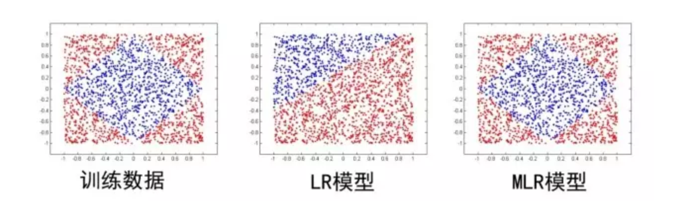

阿里近几年公开的推荐领域算法可真不少，既有传统领域的探索如MLR算法，还有深度学习领域的探索如entire -space multi-task model，Deep Interest Network等，同时跟清华大学合作展开了强化学习领域的探索，提出了MARDPG算法。

从本篇开始，我们就一起来探秘这些算法。这里，我们只是大体了解一下每一个算法的思路，对于数学部分的介绍，我们不会过多的涉及。

# 1、算法介绍

现阶段各CTR预估算法的不足

| 方法 | 简介 | 不足 |
| --- | :---: | :---: |
| 逻辑回归 | 使用了Sigmoid函数将函数值映射到0~1区间作为CTR的预估值。LR这种线性模型很容易并行化，处理上亿条训练样本不是问题。 | 线性模型的学习能力有限，需要引入大量的领域知识来人工设计特征以及特征之间的交叉组合来间接补充算法的非线性学习能力，非常消耗人力和机器资源，迁移性不够友好。 |
| Kernel方法 | 将低维特征映射到高维特征空间 | 复杂度太高而不易实现 |
| 树模型 | 如Facebook的GBDT+LR算法，有效地解决了LR模型的特征组合问题 | 是对历史行为的记忆，缺乏推广性，树模型只能学习到历史数据中的特定规则，对于新规则缺乏推广性 |
| FM模型 | 自动学习高阶属性的权值，不用通过人工的方式选取特征来做交叉 | FM模型只能拟合特定的非线性模式，常用的就是二阶FM |
| 深度神经网络 | 使用神经网络拟合数据之间的高阶非线性关系，非线性拟合能力足够强 | 适合数据规律的、具备推广性的网络结构业界依然在探索中，尤其是要做到端到端规模化上线，这里面的技术挑战依然很大 |

**那么挑战来了，如何设计算法从大规模数据中挖掘出具有推广性的非线性模式？**

# 2、MLR算法

2011-2012年期间，阿里妈妈资深专家盖坤创新性地提出了**MLR(mixed logistic regression)算法，引领了广告领域CTR预估算法的全新升级**。**MLR算法创新地提出并实现了直接在原始空间学习特征之间的非线性关系，基于数据自动发掘可推广的模式，相比于人工来说效率和精度均有了大幅提升。**

论文：https://arxiv.org/pdf/1704.05194.pdf

**MLR可以看做是对LR的一个自然推广，它采用分而治之的思路，用分片线性的模式来拟合高维空间的非线性分类面**，其形式化表达如下：

$$
p(y=1 | x)=g\left(\sum_{j=1}^{m} \sigma\left(u_{j}^{T} x\right) \eta\left(w_{j}^{T} x\right)\right)
$$

其中u是聚类参数，决定了空间的划分，w是分类参数，决定空间内的预测。这里面超参数分片数m可以较好地平衡模型的拟合与推广能力。当m=1时MLR就退化为普通的LR，m越大模型的拟合能力越强，但是模型参数规模随m线性增长，相应所需的训练样本也随之增长。因此实际应用中m需要根据实际情况进行选择。例如，在阿里的场景中，m一般选择为12。下图中MLR模型用4个分片可以完美地拟合出数据中的菱形分类面。



在实际中，MLR算法常用的形式如下，使用softmax作为分片函数：

$$
p(y=1 | x)=\sum_{i=1}^{m} \frac{\exp \left(u_{i}^{T} x\right)}{\sum_{j=1}^{m} \exp \left(u_{j}^{T} x\right)} \cdot \frac{1}{1+\exp \left(-w_{i}^{T} x\right)}
$$

在这种情况下，MLR模型可以看作是一个FOE model：

$$
p(y=1 | x)=\sum_{i=1}^{m} p(z=i | x) p(y | z=i, x)
$$

关于损失函数的设计，阿里采用了 neg-likelihood loss function以及L1，L2正则，形式如下：

$$
\begin{array}{c}{\arg \min _{\Theta} f(\Theta)=\operatorname{loss}(\Theta)+\lambda\|\Theta\|_{2,1}+\beta\|\Theta\|_{1}} \\ {\operatorname{loss}(\Theta)=-\sum_{t=1}^{n}\left[y_{t} \log \left(p\left(y_{t}=1 | x_{t}, \Theta\right)\right)+\left(1-y_{t}\right) \log \left(p\left(y_{t}=0 | x_{t}, \Theta\right)\right)\right]}\end{array}
$$

由于加入了正则项，MLR算法变的不再是平滑的凸函数，梯度下降法不再适用，因此模型参数的更新使用LBFGS和OWLQN的结合。

MLR算法适合于工业级的大规模稀疏数据场景问题，如广告CTR预估。背后的优势体现在两个方面：
- **端到端的非线性学习**：**从模型端自动挖掘数据中蕴藏的非线性模式，省去了大量的人工特征设计，这 使得MLR算法可以端到端地完成训练，在不同场景中的迁移和应用非常轻松。**
- **稀疏性**：MLR在建模时引入了L1和L2,1范数正则，可以使得最终训练出来的模型具有较高的稀疏度， 模型的学习和在线预测性能更好。当然，这也对算法的优化求解带来了巨大的挑战。

**MLR 可以看做是对 LR 的一个自然推广，它采用分而治之的思路，用分片线性的模式来拟合高维空间的非线性分类面**，其形式化表达如下：

**这里面超参数分片数 m 可以较好地平衡模型的拟合与推广能力**。
**当 m=1 时 MLR 就退化为普通的 LR，m 越大模型的拟合能力越强，但是模型参数规模随 m 线性增长，相应所需的训练样本也随之增长。**
因此实际应用中 **m 需要根据实际情况进行选择**。例如，在我们的场景中，**m 一般选择为 12**。

**MLR 算法适合于工业级的大规模稀疏数据场景问题，如广告 CTR 预估。**

背后的优势体现在两个方面：

**1）端到端的非线性学习**：从模型端自动挖掘数据中蕴藏的非线性模式，省去了大量的人工特征设计，这 使得 MLR 算法可以端到端地完成训练，在不同场景中的迁移和应用非常轻松。

**2）稀疏性**：MLR 在建模时引入了 L1 和 L2,1 范数正则，可以使得最终训练出来的模型具有较高的稀疏度， 模型的学习和在线预测性能更好。当然，这也对算法的优化求解带来了巨大的挑战，具体细节参见我们的论文（见文章尾部）。

MLR 算法高级特性

在具体的实践应用中，阿里妈妈精准定向团队进一步发展了 MLR 算法的多种高级特性，主要包括：
- **1）结构先验。**基于领域知识先验，灵活地设定空间划分与线性拟合使用的不同特征结构。例如精准定向 广告中验证有效的先验为：以 user 特征空间划分、以 ad 特征为线性拟合。直观来讲这是符合人们的认知的：不同人群具有聚类特性，同一类人群对广告有类似的偏好，例如高消费人群喜欢点击高客单价的广告。结构先验有助于帮助模型缩小解空间的探索范围，收敛更容易。
- **2）线性偏置。**这个特性提供了一个较好的方法解决 CTR 预估问题中的 bias 特征，如位置、资源位等。实际应用中我们对位置 bias 信息的建模，获得了 4% 的 RPM 提升效果。
- **3）模型级联。**MLR 支持与 LR 模型的级联式联合训练，这有点类似于 wide&deep learning。在我们的实践经验中，一些强 feature 配置成级联模式有助于提高模型的收敛性。例如典型的应用方法是：以统计反馈类特征构建第一层模型，它的输出 ( 如下图中的 FBCtr ) 级联到第二级大规模稀疏 ID 特征体系中去，这样能够有助于获得更好的提升效果。
- **4）增量训练。**实践证明，MLR 通过结构先验进行 pretrain，然后再增量进行全空间参数寻优训练，会获得进一步的效果提升。同时增量训练模式下模型达到收敛的步数更小，收敛更为稳定。在我们的实际应用中，增量训练带来的 RPM 增益达到了 3%。

# 3 算法实现

该数据是一个二分类的数据，所预测的任务是判断一个人是否能够一年挣到$50K的钱。

```
属性信息：
> 50K，<= 50K。 

年龄：连续。 
workclass：Private，Self-emp-not-inc，Self-emp-inc，Federal-gov，Local-gov，State-gov，Without-pay，Never-working。 
fnlwgt：连续的。 
教育：学士，大学，11年级，高等教育学院，副教授，副学士，副教授，9日，7日，8日，12日，硕士，第1，第4，第10，博士，5 - 6，幼儿园。 
education-num：连续的。 
婚姻状况：已婚 - 公民 - 配偶，离婚，未婚，分居，丧偶，已婚 - 配偶缺席，已婚 - AF-配偶。 
职业：技术支持，工艺修理，其他服务，销售，执行管理，专业教授，处理清洁工，机器操作，文职，农业捕鱼，运输，私人住宅 - 服务，保护服务，武装部队。 
关系：妻子，自己的孩子，丈夫，非家庭，其他亲属，未婚。 
种族：白人，亚洲 - 大陆岛民，美洲印第安人 - 爱斯基摩人，其他，黑人。 
性别：女，男。 
资本收益：持续。 
资本损失：持续。 
每周小时：连续。 
原住民：美国，柬埔寨，英格兰，波多黎各，加拿大，德国，外围美国（Guam-USVI等），印度，日本，希腊，南，中国，古巴，伊朗，洪都拉斯，菲律宾，意大利，波兰，牙买加，越南，墨西哥，葡萄牙，爱尔兰，法国，多米尼加共和国，老挝，厄瓜多尔，台湾，海地，哥伦比亚，匈牙利，危地马拉，尼加拉瓜，苏格兰，泰国，南斯拉夫，萨尔瓦多，特立尼达和多巴哥，秘鲁，洪，荷兰荷兰。
```