作为阿里妈妈精准展示技术部资深总监的盖坤在阿里的花名是靖世，被外界成为“算法天才”。2011 年，刚进阿里的盖坤提出了分片线性模型 MLR，这对当时主要使用简单线性模型做 CTR 预估的业界来说，因为极大地提高了 CTR 预估的准确性而颇具意义。几年来，MLR 模型已经被广泛应用在直通车定向和钻展业务中。

盖坤又带领团队在 CTR 预估方面推出了一个新的模型结构——深层用户网络兴趣分布网络，提出用户的兴趣是多样的，利用深度学习在用户历史性行为和广告CTR预估之间建立部分匹配，匹配度越高的历史数据对预估结果影响越大，以此分辨出当下的用户兴趣点。在3月29日新智元产业 · 跃迁 AI 技术峰会上，盖坤对这些算法进行了解读。

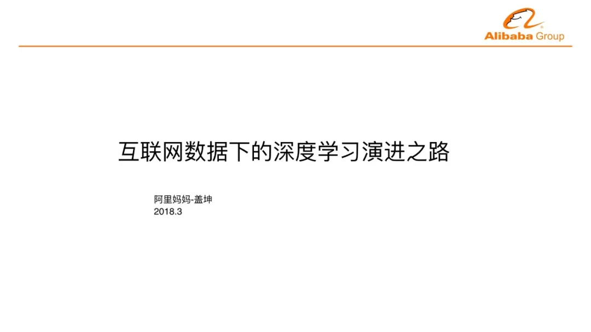

盖坤：非常高兴与大家进行“深度学习演进之路”的交流，阿里妈妈是阿里巴巴集团下的大数据营销平台，是负责阿里巴巴变现的一个事业部。我在阿里有一个花名，阿里内部大家都是用花名沟通和联系，我在阿里内部的名字是靖世，研究的方向是机器学习、计算机视觉、推荐系统和计算广告。我在清华大学读的本科和博士，专业是计算机视觉，毕业之后加入阿里巴巴广告技术部，后来组成阿里妈妈事业部，这个事业部负责阿里所有的广告变现产品。我现在是阿里妈妈的研究员，负责精准定向广告技术团队，负责的产品有智能钻展、直通车定向广告，熟悉阿里系统的同学可能会知道这两个产品。

我将分三个部分来讲一下。先讲互联网数据下的深度学习演进，然后讲一下广告推荐或者搜索业务里面怎么用深度学习，在检索里碰见的问题怎么用深度学习解决，最后对未来的挑战进行展望。

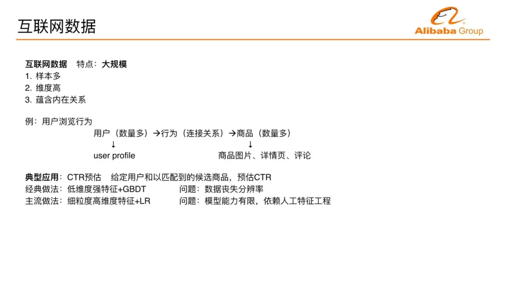

首先，互联网下的大数据。互联网的数据有什么特点？第一个特点是规模大，转化成机器学习的语言就是维度特别高，样本特别多，另外互联网数据内部也有丰富的内在的关系。

这里举一个例子，比如这是一个典型的APP或者互联网网站上的数据，一边是很多用户，另外一边很多物料，以电商为例，物料就是商品。我们现在有很多的用户有很多的商品物料，这两个都是大数据，历史上会看到很多的行为，这是用户跟商品的某种连接关系。再延展下去，每个用户都有他的Profile信息，用户看到商品的标题、详情页以及评论等等，这样延展下去规模非常大的数据会被这些关系连接到一起，这就是互联网数据的特点。

CTR预估。以经典的问题为例，为什么CTR预估很重要？这是广告、推荐、搜索业务里的核心技术，这些业务的重要性相信已经不用多提，这三个业务在很多公司来讲都是最核心的业务。以广告为例，为什么广告里的CTR预估很重要？有两点。第一，CTR预估是广告市场深度学习研究的沃土，有很多新的技术可以去探索和演进。第二，CTR预估直接跟互联网企业的平台收入相关，它其实对AI更重要。大家知道现在很多AI公司，包括公司内部的研究方向其实是对未来的布局。现金流从哪儿来？很多互联网企业的现金从广告来，所以广告重要。

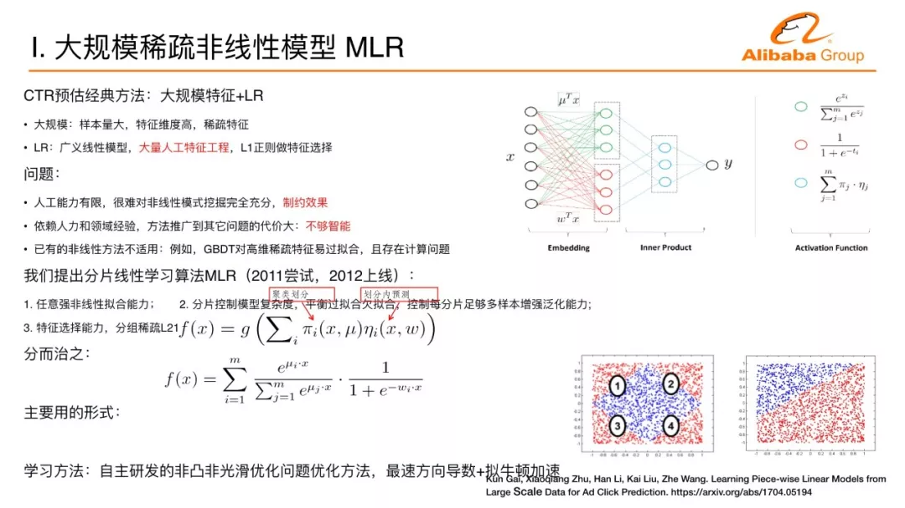

以广告为例展开，在深度学习CTR预估核心问题上的应用进展，CTR预估的传统方法分两类，第一类是人工设计的强特征，维度不会非常高，一般来讲就是一些强的统计特征，这种特征上传统的做法，以雅虎为代表的公司用的是GBDT的方法。这样的方法问题在于虽然很简单有效，但是数据的人工处理使数据丧失了分辨力，数据维度降得非常低。第二种主流做法，把数据展开成高维度的数据，经典的做法用大规模的逻辑回归，逻辑回归是广义的线性模型，模型非常简单，但它的模型能力有限。

在介绍深度学习介绍之前，我首先展开一下在阿里妈妈的第一个工作，我们把逻辑回归从简单的线性模型变成非线性模型，变成三层的神经网络。前面提到一个经典的做法用大规模的数据+逻辑回归，这个逻辑回归的一个问题是线性太简单，我们需要去做大量的人工特征工程才能把这个效果变好。这里面我们第一个想法是，如何能够让算法更智能，自动在大规模的数据里面提取非线性的模式。

我们做了这样一个尝试，去做了一个分片线性的模型，背后的思路也比较直观。把整个空间分成很多的区域，每个区域里面是一个线性模型。不同的区域做一些平滑的连接，整个空间就是分片线性的模型，当这个区域数足够多、分片数足够多，就可以逼近任意复杂的非线性曲面。

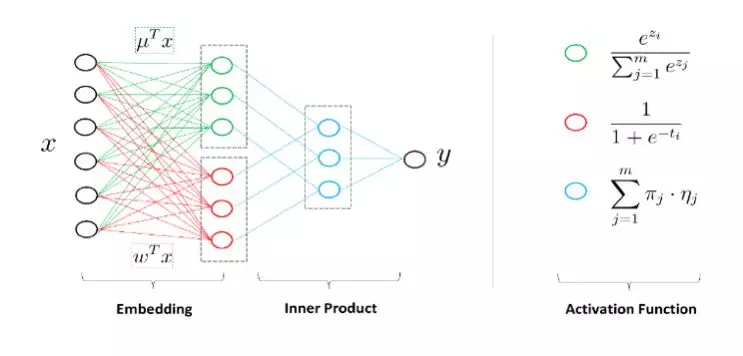

这是模型用神经网络的观点来看的示意图。来了一个样本之后怎么计算？首先计算对每个区域的隶属度，假设有四个区域，会计算一个隶属度。假设正好这个样本属于第一个区，隶属度是1000，对每个区域里面还有一个预测器或者线性分类器，对每个区域里面有一个预测值，这四个预测值组成起来又是一个向量。上面的四维向量和下面的四维向量做内积，第一个区域的预测值选出来，实际为了数学处理方便用一个软的隶属度表述而并不是1000这种硬的方式。

怎么学习这个学习模型是一个主要的问题。我们还加入了分组系数的技术，使得大数据下的模型有自动选择特征的能力。最终，它会转化成非凸非光滑的问题，这是在2011年提出的模型，2012年上线的算法。非凸非光滑的问题当时没有很好的手段，非光滑数学上表现的不是处处可导，数学上没有导数怎么进行下降也是一个问题。虽然不是处处可导，这个函数处处方向可导，我们用方向导数找到最快下降方向，并用拟牛顿法进行加速。这个工作的名称叫混合逻辑回归MLR，做过CTR预估的同学可能会知道这样一个工作。这是在我们探索深度学习在广告中应用的一个基础。

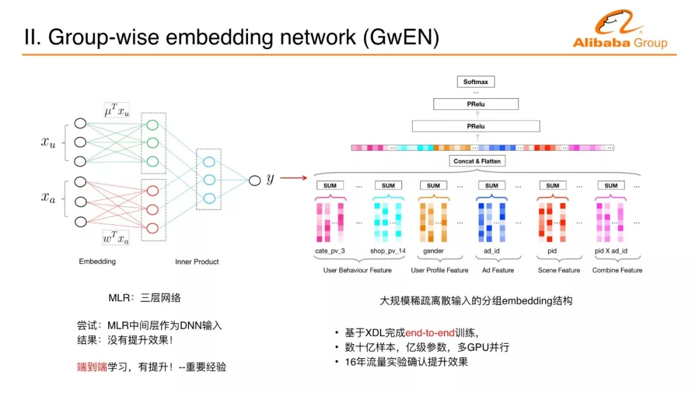

MLR是三层神经网络，把大规模稀疏的离散化输入变成两个向量做内积，两个向量拼接起来就是一个长的向量，跟现在的嵌入式技术是一样的。把一个特别大规模的数据、不好处理的数据嵌入到一个空间里面变成一个向量，在连续空间一些连续的向量用深度学习比如多层感知机，就非常容易处理。第一步尝试的深度学习是一个非常重要的经验，贯穿了所有的深度学习的设计理念，用MLR产生的中间层向量抽取出来，后面直接去做多层感知机，把这个潜入向量作为多层感知机的输入。这样没有提升效果，原因有两点。第一点，MLR本来就是非线性模式；第二点，因为没有端到端的训练。

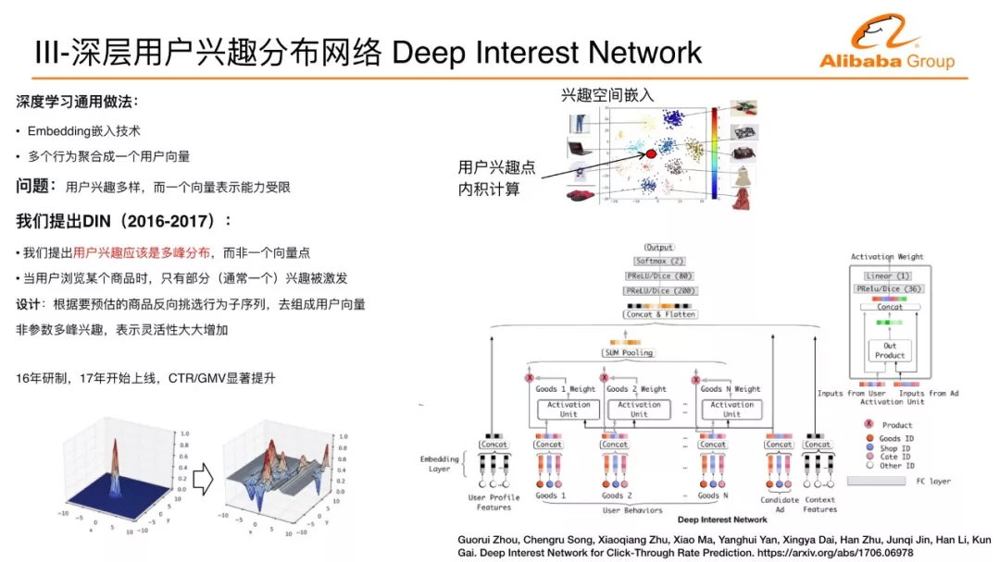

后面一个突破，把embedding的学习和多层感知机的训练放在一起端到端学习，比原来的技术有非常明显的提升。这也能够解释为什么深度学习近十年才有大的突破和进展。如果没有端到端训练，用浅层模型每次训练产生feature再训练再产生feature一层一层叠下去。之前很多人尝试都没有得出过这种深度的层叠网络，直到端到端学习，使得我们在很多问题上得到突破。我们把分组的embedding竖过来，上面是多层感知机，这就变成阿里妈妈第一代深度学习网络，基于数百亿样本、数亿的特征维度，多GPU的端到端的训练来完成这样一个业务上线。这个上线的效果使CTR和GMV的提升非常明显。

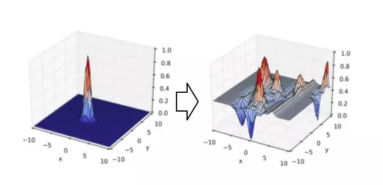

前面介绍了经典的比较标准化的深度学习在广告里面的应用，接下来我们的方向在互联网数据中，怎么样能够通过对用户行为的洞察做更好的深度学习模型。这里是一个例子，我们刚才讲到嵌入式技术，把每个商品通过嵌入式技术在嵌入空间表示一个点，一组特点用户的一系列行为通过嵌入技术表述成一个点，这个可能会代表用户。这个用户点跟商品做最后的兴趣度的计算，假设说这个计算就是跟距离成正比的话，用户的点会表示成这样一个兴趣函数在空间里面就会变成一个单峰函数，用户所处的点的地方的兴趣度最大，越远兴趣度越小。

实际上，我们用户的兴趣到底是不是一个单峰的？我们认为不是的。大家在双11有没有购物经验？是不是购物车里面加满很多不同类的商品，说明用户的兴趣是多样的，我们在非活动节点，在平时发现用户的兴趣也是多样的。用户的行为序列里面有大量不同的类目的子序列，用户在相互跳转。

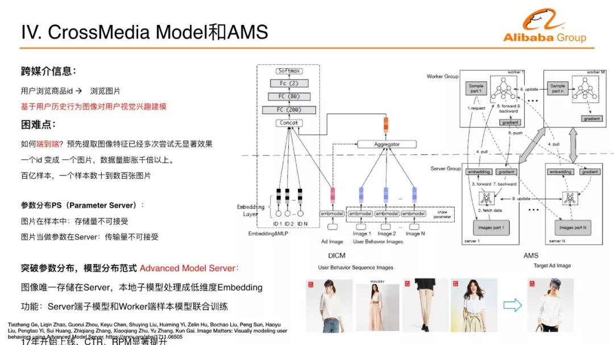

基于这样一个洞察，我们提出了用户多峰兴趣分布的深度学习神经网络，我们希望去描述用户的多个兴趣，它使用的方法是子序列提取。我们在做CTR预估的时候都有一个侯选的商品，我们拿到一个侯选的商品要预估它的点击率的时候，用这个商品去反向提取它行为序列里面对所有预估有帮助的子序列，而不是用全部的序列。这样的话就能在包含很多子序列的复杂的序列里面，把相关的子序列提取出来，用这个相关的子序列形成表达，跟这个商品关联。多峰兴趣分布可以看作是任何一个商品去找到一个比较近的峰跟它计算兴趣度，大概是这样一个过程。

我们实际上采用的一种类似attention的技术达到相关的目的，也是在阿里妈妈的流量效果上使CTR、GMV显著的指标有明显的提升。用户在互联网上浏览各种物料的时候，背后的物料本质的理解非常重要，比如在电商环境下，用户浏览商品的时候，很多时候看到这个商品的图片来决定它到底怎么样进行下一步的行为。我们能不能把这些图片信息能够到深度神经网络来做更好的用户兴趣的建模？这样带来一个挑战，任何一个行为从商品的ID变成一个商品的图片，在样本里面数据量是增大非常多倍，一个ID可能用一个几byte的字节表示，如果变成一个图片，动辄几百K甚至几兆，这个数据量至少是上千倍的增长。互联网大规模的数据需要几十或者几百或者上千台机器并行训练，数据量爆膨几千倍，即使对于阿里巴巴这样的公司，这样的问题也是很难处理的。

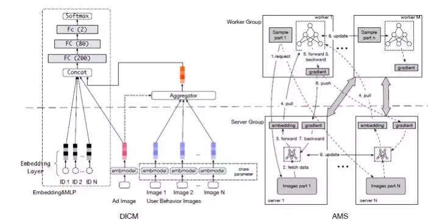

这样的挑战怎么解决？我们分析了现在在互联网的深度学习建模里面经常用的分布方式叫参数服务器（Parameter Server），我的样本有一个worker遍历样本，需要参数的时候从server端取参数。能不能承担这样的计算？首先把图像存在样本中，爆膨几千倍不可接受。存在远端的sever图像进行去冗余的存储，存储可以解决，相关的图像传过来，数据量爆膨几千倍也不可接受。远端能不能不止存储参数图像，远端是不是加一个model解决？远端有图像有model，远端的model处理图像部分的子model，worker端是遍历样本的CTR主model，这两个model嫁接到一起，做一个端到端的训练。刚才讲过，很重要的一个经验，只有端到端才work。这个图像特征在阿里妈妈内部很多团队尝试，把图像变成feature加入到CTR预估模型里面，如果CTR预估模型很强，这么加没有作用。我们做这么一个端到端的训练，提出新的模型分布的服务器，把参数分布方式变成模型分布方式，Server端不只有参数而且有子模型在计算，并且会和worker端主模型一起更新。这使得图像可以处理成一个向量再传输，几十倍、几百倍，整个传输量降下来，使得整个联合训练的过程变成可能。通过框架上的分布式的变化来完成这个挑战，在阿里妈妈的内部业务线上线，点击率或者商业平台的收益能力上有一个很显著的提升。

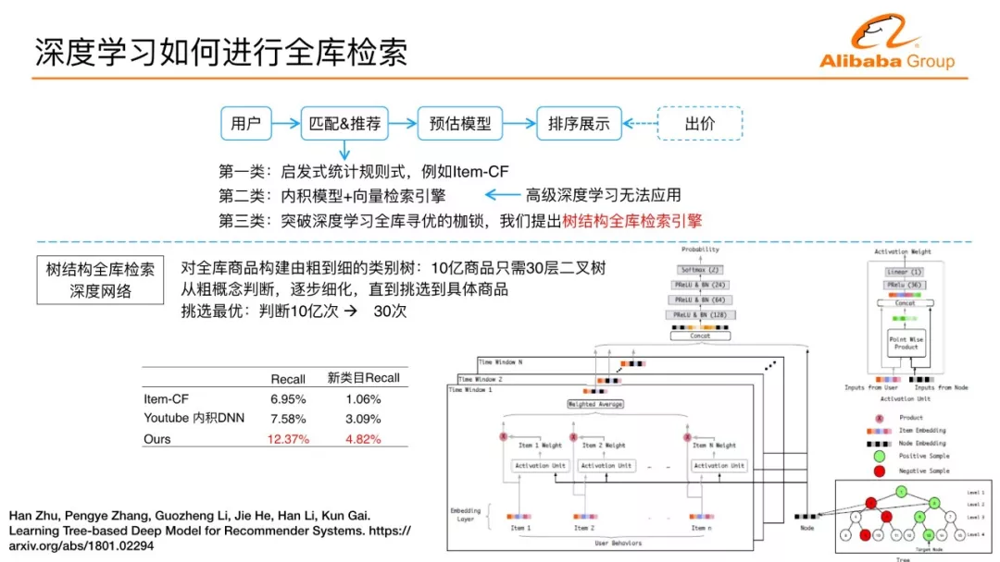

深度学习真正用在搜索推荐广告的检索系统里面，会遇见匹配问题或者检索问题。这样的一个流量端的业务一般来讲会分几个模块，来一个流量之后，一个流量背后通常代表某个用户某个场景下的浏览行为，先匹配，后面的预估模型对给定的商品做兴趣度的预估，点击率预估、转化率预估，通过预估后面有一些排序展示，广告还有出价，非广告的话没有出价环节。但我们不可能对大物料全库进行预估。

假设背后有一百亿物料，每个用户需要在线计算一百亿物料的点击率这是不可能的，前面的匹配模块需要缩减，缩减成几千、一万十万，使得在线可以承担这么多计算。流程里面前面的检索匹配环节是整个系统表现的上限，后面模型无论如何做得再精巧，前面匹配很弱的话，业务整体目标无法得到提升。匹配方法可以分为三类。启发式统计规则，现在非常精巧，而且推荐里面用的非常多的一类协同过滤，两个商品看的多就相似，协同过滤怎么匹配？通过历史行为的宝贝的商品的相似商品匹配过来，这样的话很多人会遇到用这样的一个推荐虽然很容易实行个性化，对于非个性化的业务指标来讲会有很大的提升，会带来一个问题，用户经常看到跟历史行为相似的商品，这在很多推荐场景里面可能都有一些用户去抱怨的case。

一个很自然的提升匹配能力的想法是引入机器学习去衡量兴趣度，找到最好的商品。引入机器学习，全库的计算问题很难解决，所以我们在引入机器学习的时候有一个退化的方法，如果这个模型是一个内积模型，用户是一个向量点，所有的物料都可以表示向量点，内积模型最后变成KNN查找的问题。怎么查找最近邻？有向量检索引擎可以做。CTR里面经常有交叉特征，用户兴趣分布，还有很多高级的深度学习模式，都没办法在这里面使用。我们针对怎么样用任意的深度学习来做全库的检索寻优，提出树结构的全库检索引擎，它的想法也比较直观，把整个商品建立成一棵层次化的树，有十亿产品，30层的二叉树，它的叶子层可以容纳20亿商品。我们的深度学习层每层扫描，每层找到最优，下层的节点在上一层非最优的孩子里面不继续计算，相当于丢弃，直到最后找到全库最优的，把10亿次的衡量变成30亿次从上到下的衡量，解决深度学习如何在全库找最优的问题，解决了检索和匹配的问题。这样的方法跟前两代方法比较，推荐召回率有非常明显的提升。此外，我们限定只推荐用户没有行为过类目下的物料，用新类目召回率来做一个新颖性和召回率的综合评估。比第一代的协同过滤方法在这样的评估方式下将近提升了四倍多。这是技术上解决了如何用深度学习进行全库检索的问题。

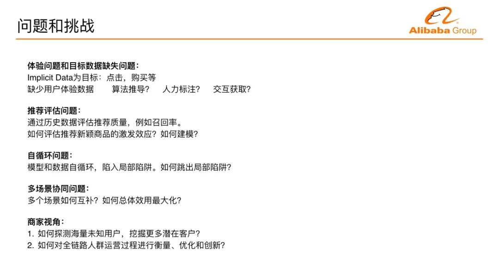

未来的挑战，对于推荐或者广告的体验问题和数据缺失问题，机器学习需要label数据也就是目标数据，现在有的目标是已经产生的用户数据点击购买等等数据。我们能够对这些指标做最优化，很多体验问题我们没有Label很难优化，导致很难用机器学习去解这些问题。如何解决体验问题？用算法自动去推导背后的用户体验还是用人力标注，像搜索引擎用相关性团队去标注用户的感受还是通过交互让用户主动来反馈？这个是未来需要探索的问题。

推荐评估问题，不管是工业界、学术界经常用召回率来评估，实际上召回率只评估用户消费过商品的表现，如何评估新推荐商品对用户的激发效应，这在召回率评估上并没有体现。还有推荐的自循环问题，你感兴趣的东西你点的多，推荐下一步会推荐越来越多，最后丧失掉很多其它你可能感兴趣的其它推荐。在很多APP上推荐场景有很多，多场景下如何来做协同？从商家视角，每个商家其实面向的都是全量的海量用户，如何探测潜在的客户。商家面对的是整个消费者的运营过程，潜在兴趣阶段、购买阶段整个链路上如何进行优化创新，这是面对商家在商业上希望能解决的问题。

阿里妈妈技术团队在深度学习上持续演进和创新。我们追求业务结果，希望在追求业务结果背后能够在技术上做一点不一样的事情，希望能够做一些业务的创新模式，如果有同学感兴趣的话欢迎联系我们。阿里妈妈携手天池承办的这一届阿里妈妈国际广告算法大赛，大家有兴趣欢迎来挑战。

**阿里妈妈国际广告算法大赛**:
阿里巴巴（淘宝、天猫）是中国最大的电子商务平台，为数亿用户提供了便捷优质的交易服务，也积累了海量的交易数据。阿里妈妈作为阿里巴巴广告业务部门，在过去几年利用这些数据采用深度学习、在线学习、强化学习等人工智能技术来高效准确地预测用户的购买意向，有效提高了用户的购物体验和广告主的ROI。然而，作为一个复杂的生态系统，电商平台中的用户行为偏好、商品长尾分布、热点事件营销等因素依然给转化率预估带来了巨大挑战。比如，在双十一购物狂欢节期间，商家和平台的促销活动会导致流量分布变化剧烈，在正常流量上训练的模型无法很好地匹配这些特殊流量。如何更好地利用海量的交易数据来高效准确地预测用户的购买意向，是人工智能和大数据在电子商务场景中需要继续解决的技术难题。

2018年，阿里妈妈联合国际人工智能联合会议（IJCAI-2018）以及阿里云天池平台，启动阿里妈妈国际广告算法大赛，以阿里电商广告为研究对象，提供平台的海量真实场景数据，参赛选手通过人工智能技术构建预测模型，预估用户购买意向。优胜队伍不仅有丰厚的奖金和差旅赞助费用，更可有参加7月于斯德哥尔摩举办的IJCAI-2018主会的资格。