前面我们介绍了MLR算法，通过分而治之的思想改进了传统的LR算法，使其能够拟合更复杂的线性关系。这一篇，我们来简单理解和实现一下阿里在去年提出的另一个重要的推荐系统模型-深度兴趣网络(DIN,Deep Interest Network). 该方法由盖坤大神领导的阿里妈妈的精准定向检索及基础算法团队提出，充分利用/挖掘用户历史行为数据中的信息来提高CTR预估的性能。

# 1、背景

深度学习在CTR预估领域已经有了广泛的应用，常见的算法比如Wide&Deep，DeepFM等。这些方法一般的思路是：**通过Embedding层，将高维离散特征转换为固定长度的连续特征，然后通过多个全联接层，最后通过一个sigmoid函数转化为0-1值，代表点击的概率。即Sparse Features -> Embedding Vector -> MLPs -> Sigmoid -> Output.**

这种方法的优点在于：通过神经网络可以拟合高阶的非线性关系，同时减少了人工特征的工作量。

不过，阿里的研究者们通过观察收集到的线上数据，发现了用户行为数据中有两个很重要的特性：
- Diversity：用户在浏览电商网站的过程中显示出的兴趣是十分多样性的。
- Local activation: 由于用户兴趣的多样性，只有部分历史数据会影响到当次推荐的物品是否被点击，而不是所有的历史记录。

这两种特性是密不可分的。

举个简单的例子，观察下面的表格：

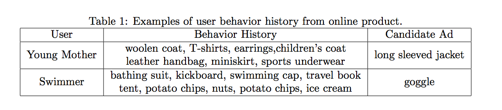

- Diversity体现在年轻的母亲的历史记录中体现的兴趣十分广泛，涵盖羊毛衫、手提袋、耳环、童装、运动装等等。而爱好游泳的人同样兴趣广泛，历史记录涉及浴装、旅游手册、踏水板、马铃薯、冰激凌、坚果等等。

- Local activation体现在，当我们给爱好游泳的人推荐goggle(护目镜)时，跟他之前是否购买过薯片、书籍、冰激凌的关系就不大了，而跟他游泳相关的历史记录如游泳帽的关系就比较密切。

针对上面提到的用户行为中存在的两种特性，阿里将其运用于自身的推荐系统中，推出了深度兴趣网路DIN，接下来，我们就一起来看一下模型的一些实现细节，然后我们会给出一个简化版的tensorflow实现。

# 2、模型设计

## 整体框架

我们先来看一下推荐系统的整体框架：
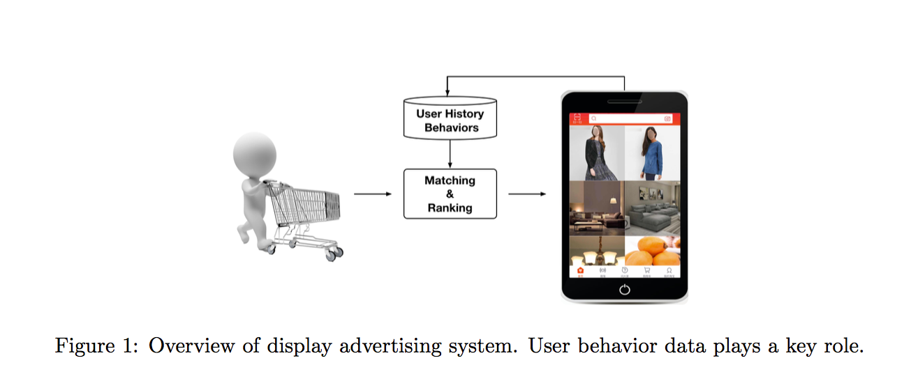
整个流程可以描述为：
- 1.检查用户历史行为数据
- 2.使用matching module产生候选ads。
- 3.通过ranking module做point-wise的排序，即得到每个候选ads的点击概率，并根据概率排序得到推荐列表。
- 4.记录下用户在当前展示广告下的反应(点击与否)，作为label。

## 特征设计

本文将所涉及到的特征分为四个部分：**用户特征、用户行为特征、广告特征、上下文特征**，具体如下：
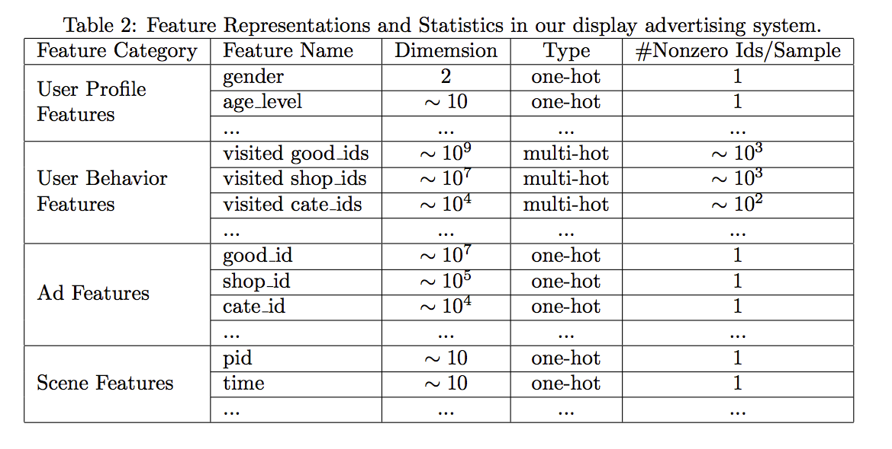
其中，用户行为特征是multi-hot的，即多值离散特征。针对这种特征，由于每个涉及到的非0值个数是不一样的，常见的做法就是将id转换成embedding之后，加一层pooling层，比如average-pooling，sum-pooling，max-pooling。DIN中使用的是weighted-sum，其实就是加权的sum-pooling，权重经过一个activation unit计算得到。这里我们后面还会再介绍到。

## BaseModel

在介绍DIN之前，我们先来看一下一个基准模型，结构如下：
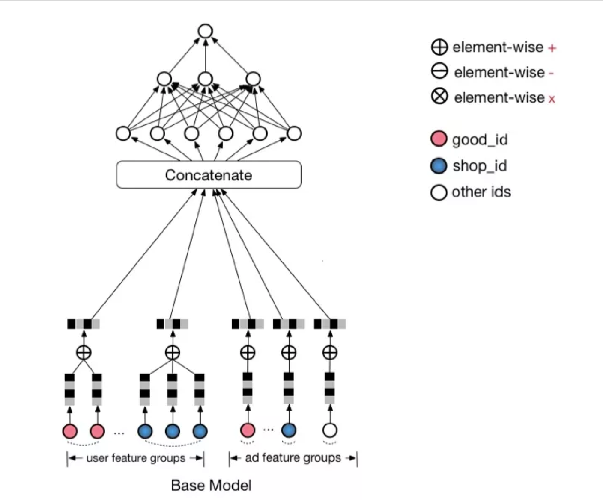
这里element-wise的意思其实就是元素级别的加减，同时，可不要忽略广播的存在哟。一个元素和一个向量相乘，也可以看作element-wise的，因为这个元素会广播成和向量一样的长度嘛，嘻嘻。

可以看到，Base Model首先吧one-hot或multi-hot特征转换为特定长度的embedding，作为模型的输入，然后经过一个DNN的part，得到最终的预估值。特别地，针对multi-hot的特征，做了一次element-wise+的操作，这里其实就是sum-pooling，这样，不管特征中有多少个非0值，经过转换之后的长度都是一样的！

## Deep Interest Network

Base Model有一个很大的问题，它对用户的历史行为是同等对待的，没有做任何处理，这显然是不合理的。一个很显然的例子，离现在越近的行为，越能反映你当前的兴趣。因此，对用户历史行为基于Attention机制进行一个加权，阿里提出了深度兴趣网络（Deep Interest Network)，先来看一下模型结构：
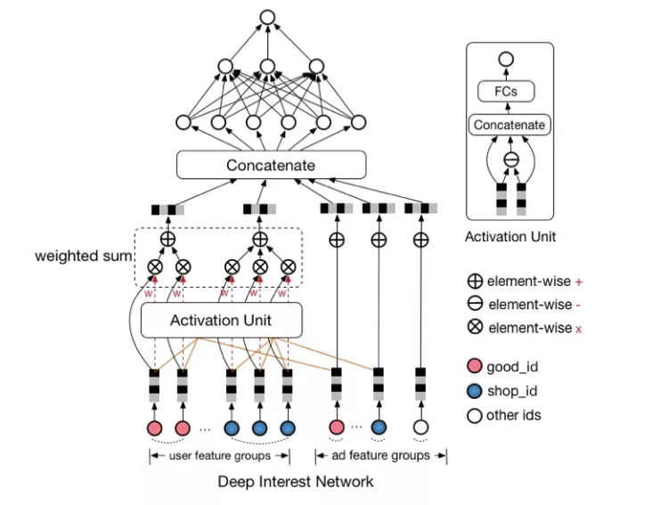
Attention机制简单的理解就是，针对不同的广告，用户历史行为与该广告的权重是不同的。假设用户有ABC三个历史行为，对于广告D，那么ABC的权重可能是0.8、0.1、0.1；对于广告E，那么ABC的权重可能是0.3、0.6、0.1。这里的权重，就是Attention机制即上图中的Activation Unit所需要学习的。

为什么要引入这一个机制呢？难道仅仅是通过观察历史数据拍脑袋决定的么？当然不是，如果不用Local activation的话，将会出现下面的情况：假设用户的兴趣的Embedding是Vu，候选广告的Embedding是Va，用户兴趣和候选的广告的相关性可以写作F(U,A) = Va * Vu。如果没有Local activation机制的话，那么同一个用户对于不同的广告，Vu都是相同的。举例来说，如果有两个广告A和B，用户兴趣和A，B的相似性都很高，那么在Va和Vb连线上的广告都会有很高的相似性。这样的限制使得模型非常难学习到有效的用户和广告的embedidng表示。

在加入Activation Unit之后，用户的兴趣表示计算如下：
$$
V_{u}=f\left(V_{a}\right)=\sum_{i=1}^{N} w_{i} * V_{i}=\sum_{i=1}^{N} g\left(V_{i}, V_{a}\right) * V_{i}
$$

其中，Vi表示behavior id i的嵌入向量，比如good_id,shop_id等。Vu是所有behavior ids的加权和，表示的是用户兴趣；Va是候选广告的嵌入向量；wi是候选广告影响着每个behavior id的权重，也就是Local Activation。wi通过Activation Unit计算得出，这一块用函数去拟合，表示为g(Vi,Va)。

# 3、模型细节

## 3.1 评价指标GAUC

模型使用的评价指标是GAUC，我们先来看一下GAUC的计算公式：

$$
\mathrm{GAUC}=\frac{\sum_{i=1}^{n} w_{i} * \mathrm{AUC}_{i}}{\sum_{i=1}^{n} w_{i}}=\frac{\sum_{i=1}^{n} i m p r e s \operatorname{sion}_{i} * \mathrm{AUC}_{i}}{\sum_{i=1}^{n} i m p r e s i o n_{i}}
$$

我们首先要肯定的是，AUC是要分用户看的，我们的模型的预测结果，只要能够保证对每个用户来说，他想要的结果排在前面就好了。
假设有两个用户A和B，每个用户都有10个商品，10个商品中有5个是正样本，我们分别用TA，TB，FA，FB来表示两个用户的正样本和负样本。也就是说，20个商品中有10个是正样本。假设模型预测的结果大小排序依次为TA，FA，TB，FB。如果把两个用户的结果混起来看，AUC并不是很高，因为有5个正样本排在了后面，但是分开看的话，每个用户的正样本都排在了负样本之前，AUC应该是1。显然，分开看更容易体现模型的效果，这样消除了用户本身的差异。
但是上文中所说的差异是在用户点击数即样本数相同的情况下说的。还有一种差异是用户的展示次数或者点击数，如果一个用户有1个正样本，10个负样本，另一个用户有5个正样本，50个负样本，这种差异同样需要消除。那么GAUC的计算，不仅将每个用户的AUC分开计算，同时根据用户的展示数或者点击数来对每个用户的AUC进行加权处理。进一步消除了用户偏差对模型的影响。通过实验证明，GAUC确实是一个更加合理的评价指标。

## 3.2 Dice激活函数

## 从Relu到PRelu

Relu激活函数形式如下：
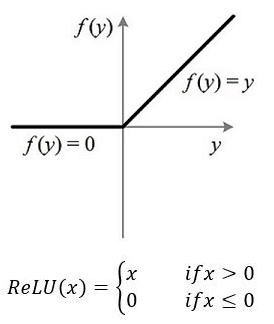
Relu激活函数在值大于0时原样输出，小于0时输出为0。这样的话导致了许多网络节点的更新缓慢。因此又了PRelu，也叫Leaky Relu，形式如下：
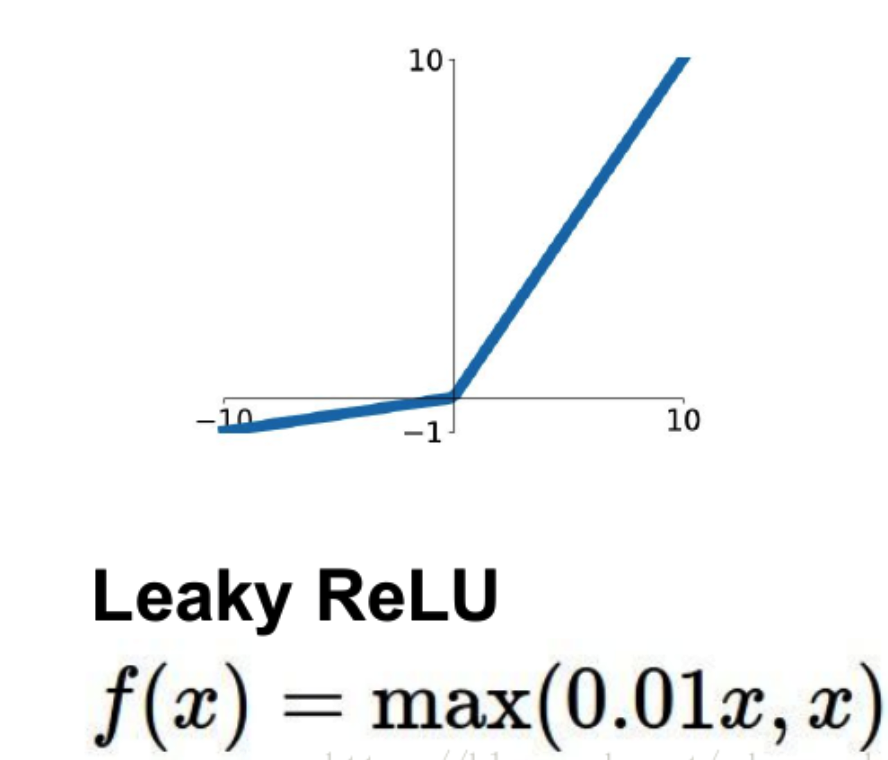
这样，及时值小于0，网络的参数也得以更新，加快了收敛速度。

## 从PReLU到Dice

尽管对Relu进行了修正得到了PRelu，但是仍然有一个问题，即我们认为分割点都是0，但实际上，分割点应该由数据决定，因此文中提出了Dice激活函数

Dice激活函数的全称是Data Dependent Activation Function，形式如下：

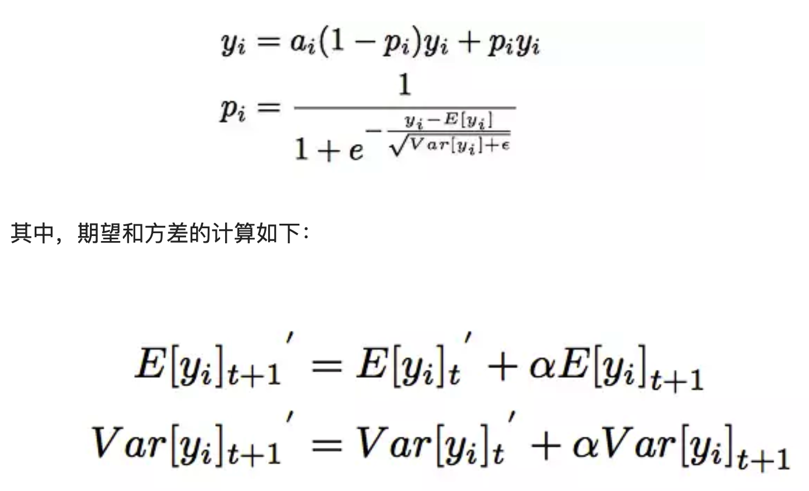

可也看到，每一个yi对应了一个概率值pi。pi的计算主要分为两步：将yi进行标准化和进行sigmoid变换。

## 3.3 自适应正则 Adaptive Regularization

CTR中输入稀疏而且维度高，通常的做法是加入L1、L2、Dropout等防止过拟合。但是论文中尝试后效果都不是很好。用户数据符合长尾定律long-tail law，也就是说很多的feature id只出现了几次，而一小部分feature id出现很多次。这在训练过程中增加了很多噪声，并且加重了过拟合。

对于这个问题一个简单的处理办法就是：直接去掉出现次数比较少的feature id。但是这样就人为的丢掉了一些信息，导致模型更加容易过拟合，同时阈值的设定作为一个新的超参数，也是需要大量的实验来选择的。

因此，阿里提出了自适应正则的做法，即：
- 1.针对feature id出现的频率，来自适应的调整他们正则化的强度；
- 2.对于出现频率高的，给与较小的正则化强度；
- 3.对于出现频率低的，给予较大的正则化强度。

计算公式如下：

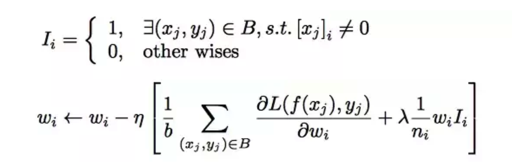

# 4、效果展示
下图是对Local Activation效果的一个展示，可以看到，对于候选的广告是一件衣服的时候，用户历史行为中跟衣服相关的权重较高，而非衣服的部分，权重较低。
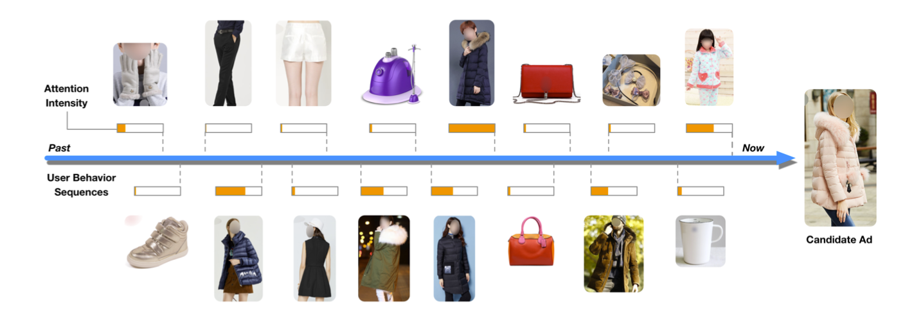
下图是对使用不同正则项的结果进行的展示，可以发现，使用自适应正则的情况下，模型的验证集误差和验证集GAUC均是最好的。
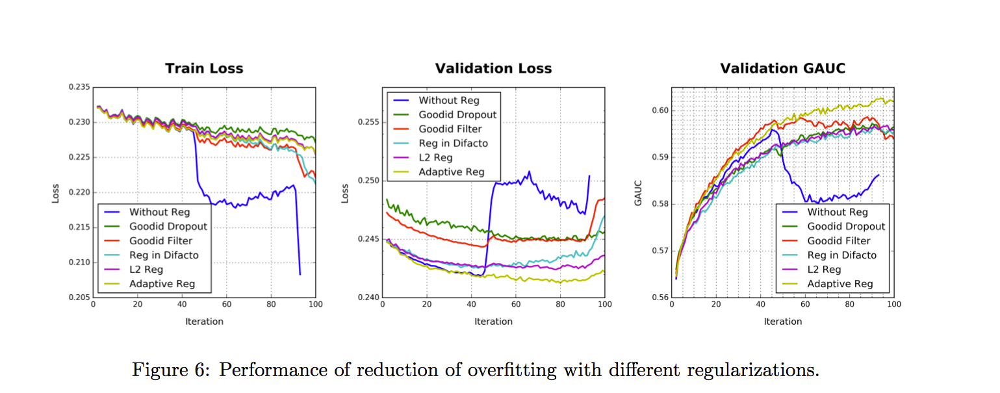
下图对比了Base Model和DIN的实验结果，可以看到，DIN模型在加入Dice激活函数以及自适应正则之后，模型的效果有了一定的提升：
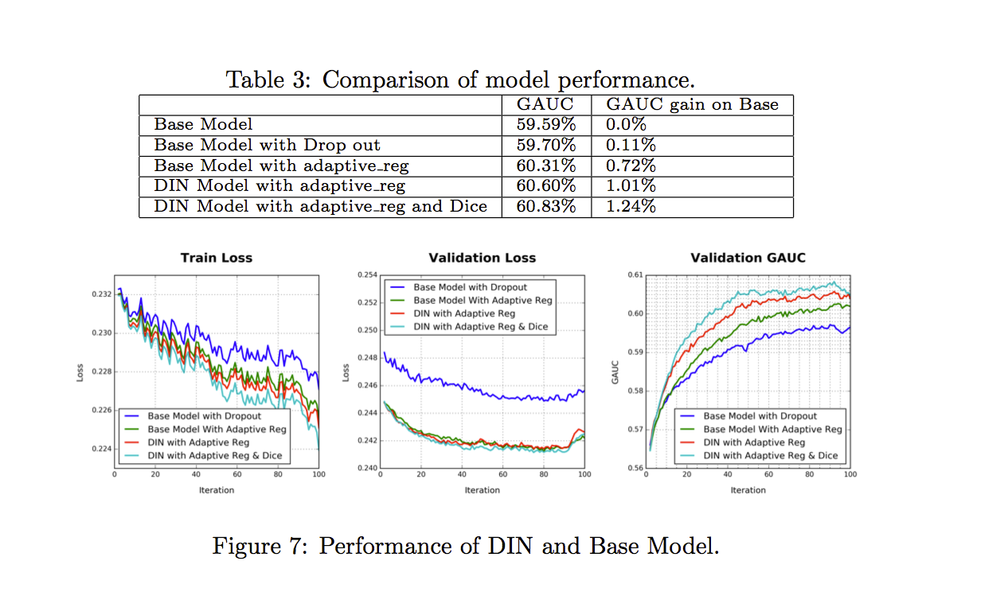

# 参考文献
1、盖坤演讲视频：http://www.itdks.com/dakalive/detail/3166
2、论文：Deep Interest Network for Click-Through Rate Prediction
3、github：https://github.com/zhougr1993/DeepInterestNetwork

# 代码实战

使用 Tensorflow2完成


运行过程：

```python

```