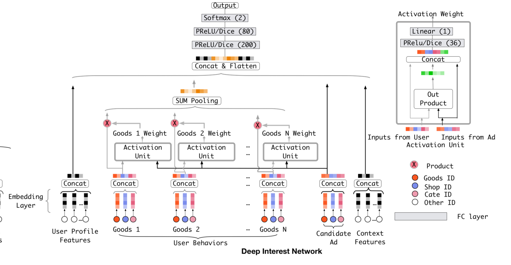
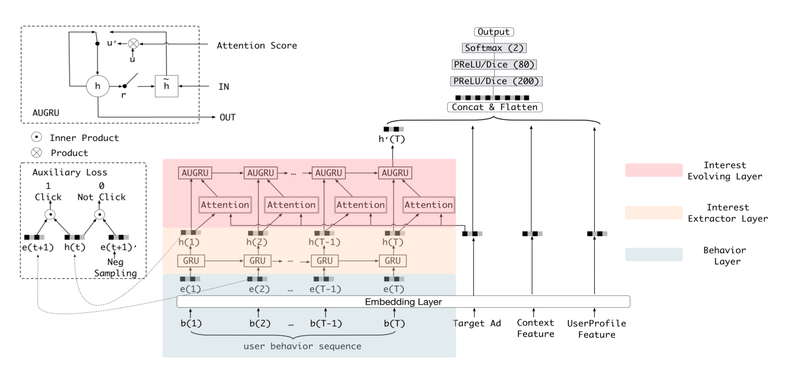
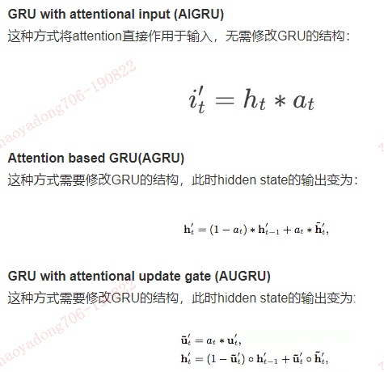
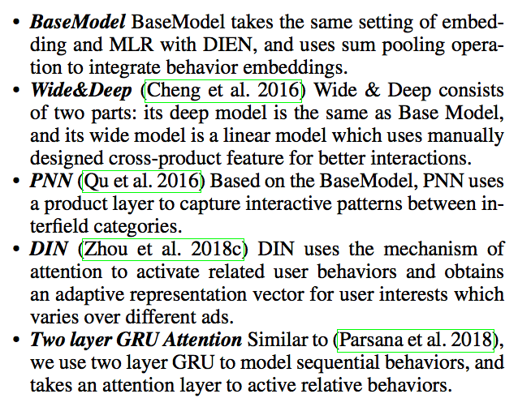
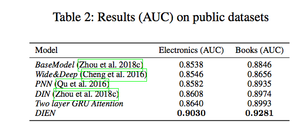
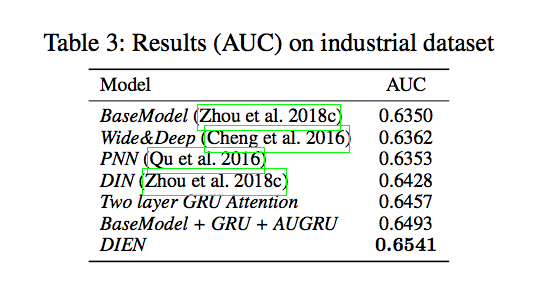
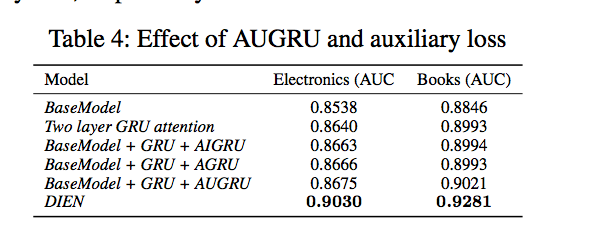

前面，我们介绍了阿里的深度兴趣网络(Deep Interest Network，以下简称DIN)，时隔一年，阿里再次升级其模型，提出了深度兴趣进化网络(Deep Interest Evolution Network,以下简称DIEN，论文地址：https://arxiv.org/pdf/1809.03672.pdf)，并将其应用于淘宝的广告系统中，获得了20.7%的CTR的提升。

# 1、背景

在大多数非搜索电商场景下，用户并不会实时表达目前的兴趣偏好。因此通过设计模型来捕获用户的动态变化的兴趣，是提升CTR预估效果的关键。**阿里之前的DIN模型将用户的历史行为来表示用户的兴趣，并强调了用户兴趣的多样性和动态变化性，因此通过attention-based model来捕获和目标物品相关的兴趣。**虽然DIN模型将用户的历史行为来表示兴趣，但存在两个缺点：

- **1）用户的兴趣是不断进化的，而DIN抽取的用户兴趣之间是独立无关联的，没有捕获到兴趣的动态进化性**
- **2）通过用户的显式的行为来表达用户隐含的兴趣，这一准确性无法得到保证。**

基于以上两点，**阿里提出了深度兴趣演化网络DIEN来CTR预估的性能**。DIEN模型的主要贡献点在于：
- 1）模**型关注电商系统中兴趣演化的过程，并提出了新的网络结果来建模兴趣进化的过程，这个模型能够更精确的表达用户兴趣，同时带来更高的CTR预估准确率。**
- 2）设计了**兴趣抽取层**，并通过计算一个辅助loss，来提升兴趣表达的准确性。
- 3）设计了**兴趣进化层**，来更加准确的表达用户兴趣的动态变化性。

接下来，我们来一起看一下DIEN模型的原理。

# 2、DIEN模型原理

## 2.1 模型总体结构

我们先来对比一下DIN和DIEN的结构。

DIN的模型结构如下：

DIEN的模型结构如下：

可以看到，DIN和DIEN的最底层都是**Embedding Layer，User profile， target AD和context feature**的处理方式是一致的。不同的是，**DIEN将user behavior组织成了序列数据的形式，并把简单的使用外积完成的activation unit变成了一个attention-based GRU网络。**

## 2.2 兴趣抽取层Interest Extractor Layer

**兴趣抽取层Interest Extractor Layer**的主要目标是**从embedding数据中提取出interest**。但一个用户在某一时间的interest不仅与当前的behavior有关，也与之前的behavior相关，所以**作者们使用GRU单元来提取interest**。GRU单元的表达式如下：

$$
\begin{array}{l}{\mathbf{u}_{t}=\sigma\left(W^{u} \mathbf{i}_{t}+U^{u} \mathbf{h}_{t-1}+\mathbf{b}^{u}\right)} \\ {\mathbf{r}_{t}=\sigma\left(W^{r} \mathbf{i}_{t}+U^{r} \mathbf{h}_{t-1}+\mathbf{b}^{r}\right)} \\ {\tilde{\mathbf{h}}_{t}=\tanh \left(W^{h} \mathbf{i}_{t}+\mathbf{r}_{t} \circ U^{h} \mathbf{h}_{t-1}+\mathbf{b}^{h}\right)} \\ {\mathbf{h}_{t}=\left(\mathbf{1}-\mathbf{u}_{t}\right) \circ \mathbf{h}_{t-1}+\mathbf{u}_{t} \circ \tilde{\mathbf{h}}_{t}}\end{array}
$$

这里我们可以认为ht是提取出的用户兴趣，但是这个地方兴趣是否表示的合理呢？文中别出心裁的增加了一个辅助loss，来提升兴趣表达的准确性：

这里，作者设计了一个二分类模型来计算兴趣抽取的准确性，我们将用户下一时刻真实的行为e(t+1)作为正例，负采样得到的行为作为负例e(t+1)'，分别与抽取出的兴趣h(t)结合输入到设计的辅助网络中，得到预测结果，并通过logloss计算一个辅助的损失：

$$
\begin{aligned} L_{a u x}=-& \frac{1}{N}\left(\sum_{i=1}^{N} \sum_{t} \log \sigma\left(\mathbf{h}_{t}, \mathbf{e}_{b}^{i}[t+1]\right)\right.\\ &\left.+\log \left(1-\sigma\left(\mathbf{h}_{t}, \hat{\mathbf{e}}_{b}^{i}[t+1]\right)\right)\right) \end{aligned}
$$

## 2.3 兴趣进化层Interest Evolution Layer

兴趣进化层Interest Evolution Layer的主要目标是刻画用户兴趣的进化过程。举个简单的例子：
以用户对衣服的interest为例，随着季节和时尚风潮的不断变化，用户的interest也会不断变化。这种变化会直接影响用户的点击决策。建模用户兴趣的进化过程有两方面的好处：

- 1）追踪用户的interest可以使我们学习final interest的表达时包含更多的历史信息。
- 2）可以根据interest的变化趋势更好地进行CTR预测。

而interest在变化过程中遵循如下规律：
- 1）interest drift：用户在某一段时间的interest会有一定的集中性。比如用户可能在一段时间内不断买书，在另一段时间内不断买衣服。
- 2）interest individual：一种interest有自己的发展趋势，不同种类的interest之间很少相互影响，例如买书和买衣服的interest基本互不相关。
为了利用这两个时序特征，我们需要再增加一层GRU的变种，并加上attention机制以找到与target AD相关的interest。

attention的计算方式如下：

$$
a_{t}=\frac{\exp \left(\mathbf{h}_{t} W \mathbf{e}_{a}\right)}{\sum_{j=1}^{T} \exp \left(\mathbf{h}_{j} W \mathbf{e}_{a}\right)}
$$

而Attention和GRU结合起来的机制有很多，文中介绍了一下三种：

## 2.4 模型试验

文章在公共数据和自己的数据集上都做了实验，并选取了不同的对比模型：

离线实验的结果如下：

**DIEN使用了辅助loss和AUGRU结构，而BaseModel + GRU + AUGRU与DIEN的不同之处就是没有增加辅助loss**。可以看到，**DIEN的实验效果远好于其他模型。**