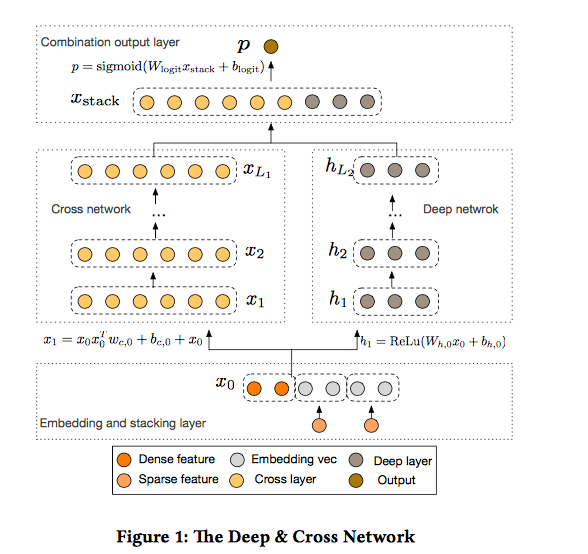
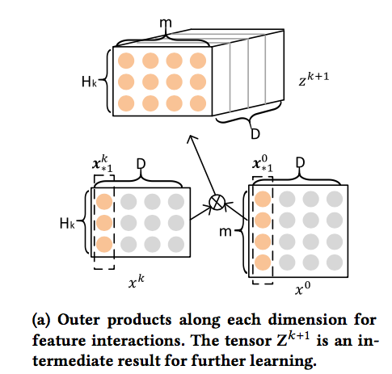
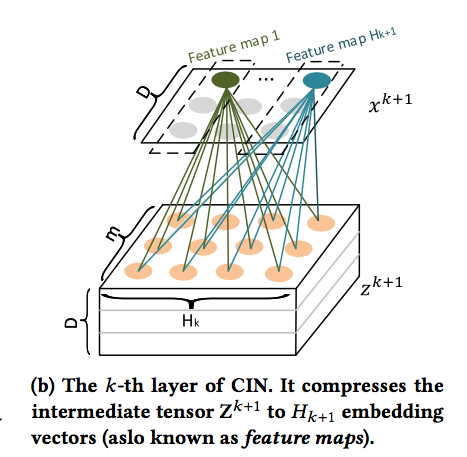
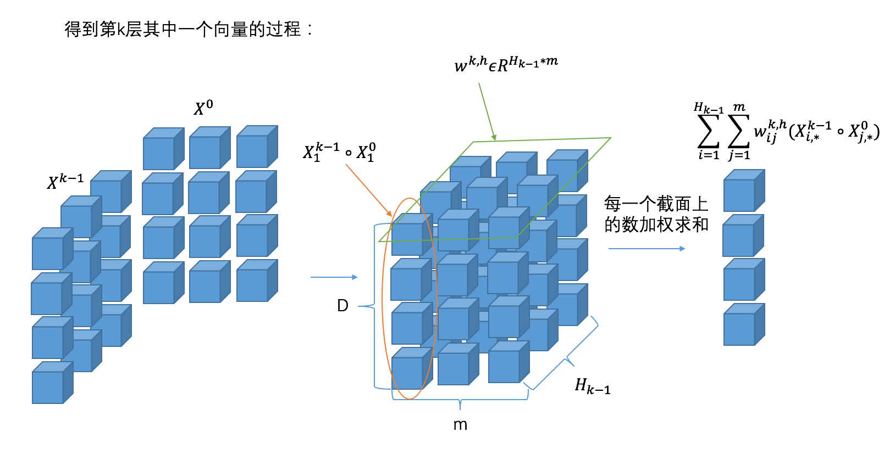
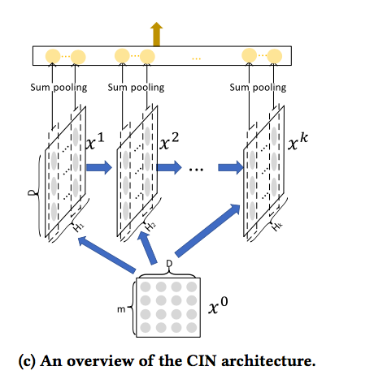
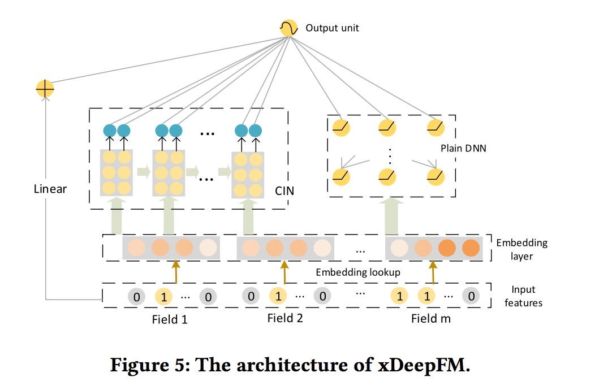
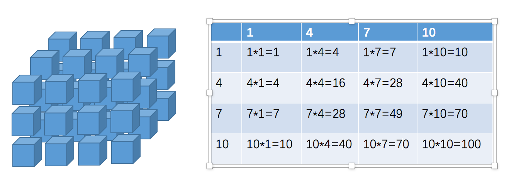

# 1、引言

对于预测性的系统来说，特征工程起到了至关重要的作用。特征工程中，挖掘交叉特征是至关重要的。交叉特征指的是两个或多个原始特征之间的交叉组合。例如，在新闻推荐场景中，**一个三阶交叉特征为`AND(user_organization=msra,item_category=deeplearning,time=monday_morning)`**,它表示当前用户的工作单位为微软亚洲研究院，当前文章的类别是与深度学习相关的，并且推送时间是周一上午。

传统的推荐系统中，挖掘交叉特征主要依靠人工提取，这种做法主要有以下三种缺点：

- 1）**重要的特征都是与应用场景息息相关的，针对每一种应用场景，工程师们都需要首先花费大量时间和精力深入了解数据的规律之后才能设计、提取出高效的高阶交叉特征，因此人力成本高昂**；
- 2）**原始数据中往往包含大量稀疏的特征，例如用户和物品的ID，交叉特征的维度空间是原始特征维度的乘积，因此很容易带来维度灾难的问题**；
- 3）**人工提取的交叉特征无法泛化到未曾在训练样本中出现过的模式中**。

因此自动学习特征间的交互关系是十分有意义的。**目前大部分相关的研究工作是基于因子分解机的框架，利用多层全连接神经网络去自动学习特征间的高阶交互关系，例如FNN、PNN和DeepFM等。其缺点是模型学习出的是隐式的交互特征，其形式是未知的、不可控的**；**<font color= blue>同时它们的特征交互是发生在元素级（bit-wise）而不是特征向量之间（vector-wise），这一点违背了因子分解机的初衷</font>**。

来自Google的团队在KDD 2017 AdKDD&TargetAD研讨会上提出了**DCN模型，旨在显式（explicitly）地学习高阶特征交互，其优点是模型非常轻巧高效，但缺点是最终模型的表现形式是一种很特殊的向量扩张，同时特征交互依旧是发生在元素级上。**

我们用下图来回顾一下DCN的实现：



下面是我对文中提到的两个重要概念的理解：

## bit-wise VS vector-wise

假设隐向量的维度为3维:
- 如果两个特征(对应的向量分别为(a1,b1,c1)和(a2,b2,c2)的话）在进行交互时，交互的形式类似于f(w1 * a1 * a2,w2 * b1 * b2 ,w3 * c1 * c2)的话，此时我们认为特征交互是发生在**元素级（bit-wise）**上。
- 如果特征交互形式类似于 f(w * (a1 * a2 ,b1 * b2,c1 * c2))的话，那么我们认为**特征交互是发生在特征向量级（vector-wise）**。

## explicitly VS implicitly

**显式的特征交互和隐式的特征交互。**以两个特征为例xi和xj，在经过一系列变换后，我们可以表示成 wij * (xi * xj)的形式，就可以认为是显式特征交互，否则的话，是隐式的特征交互。

微软亚洲研究院社会计算组提出了一种**极深因子分解机模型（xDeepFM），不仅能同时以显式和隐式的方式自动学习高阶的特征交互，使特征交互发生在向量级，还兼具记忆与泛化的学习能力。**

我们接下来就来看看**xDeepFM这个模型**是怎么做的吧！

# 2、xDeepFM模型介绍

## 2.1 Compressed Interaction Network

为了实现自动学习显式的高阶特征交互，同时使得交互发生在向量级上，文中首先提出了一种新的名为**压缩交互网络（Compressed Interaction Network，简称CIN）的神经模型**。在CIN中，隐向量是一个单元对象，因此我们将输入的原特征和神经网络中的隐层都分别组织成一个矩阵，记为X0和Xk。CIN中每一层的神经元都是根据前一层的隐层以及原特征向量推算而来，其计算公式如下：

$$
\mathbf{X}_{h, *}^{k}=\sum_{i=1}^{H_{k-1}} \sum_{j=1}^{m} \mathbf{W}_{i j}^{k, h}\left(\mathbf{X}_{i, *}^{k-1} \circ \mathbf{X}_{j, *}^{0}\right)
$$

其中点乘的部分计算如下：

$$
<a_{1}, a_{2}, a_{3}>\cdot<b_{1}, b_{2}, b_{3}>=<a_{1} b_{1}, a_{2} b_{2}, a_{3} b_{3}>
$$

我们来解释一下上面的过程，第k层隐层含有H_k条神经元向量。隐层的计算可以分成两个步骤：（1）根据前一层隐层的状态Xk和原特征矩阵X0，计算出一个中间结果Z^k+1，它是一个三维的张量，如下图所示：



在这个中间结果上，我们用Hk+1个尺寸为m*Hk的卷积核生成下一层隐层的状态，该过程如图2所示。这一操作与计算机视觉中最流行的卷积神经网络大体是一致的，唯一的区别在于卷积核的设计。CIN中一个神经元相关的接受域是垂直于特征维度D的整个平面，而CNN中的接受域是当前神经元周围的局部小范围区域，因此CIN中经过卷积操作得到的特征图（Feature Map）是一个向量，而不是一个矩阵。



如果你觉得原文中的图不够清楚的话，希望下图可以帮助你理解整个过程：



CIN的宏观框架可以总结为下图：

可以看出，它的特点是，最终学习出的特征交互的阶数是由网络的层数决定的，每一层隐层都通过一个池化操作连接到输出层，从而保证了输出单元可以见到不同阶数的特征交互模式。同时不难看出，CIN的结构与循环神经网络RNN是很类似的，即每一层的状态是由前一层隐层的值与一个额外的输入数据计算所得。不同的是，CIN中不同层的参数是不一样的，而在RNN中是相同的；RNN中每次额外的输入数据是不一样的，而CIN中额外的输入数据是固定的，始终是X^0。

可以看到，CIN是通过（vector-wise）来学习特征之间的交互的，还有一个问题，就是它为什么是显式的进行学习？我们先从X1来开始看，X1的第h个神经元向量可以表示成：

$$
\mathbf{x}_{h}^{1}=\sum_{i \in[m] \atop j \in[m]} \mathbf{W}_{i, j}^{1, h}\left(\mathbf{x}_{i}^{0} \circ \mathbf{x}_{j}^{0}\right)
$$

进一步，X^2的第h个神经元向量可以表示成：

$$
\begin{aligned} \mathbf{x}_{h}^{2}=& \sum_{i \in[m]} \mathbf{W}_{i, j}^{2, h}\left(\mathbf{x}_{i}^{1} \circ \mathbf{x}_{j}^{0}\right) \\ &=\sum_{i \in[m]} \sum_{l \in[m]} \mathbf{W}_{i, j}^{2, h} \mathbf{W}_{l, k}^{1, i}\left(\mathbf{x}_{j}^{0} \circ \mathbf{x}_{k}^{0} \circ \mathbf{x}_{l}^{0}\right) \\ & j \in[m] k \in[m] \end{aligned}
$$

最后，第k层的第h个神经元向量可以表示成：

$$
\mathbf{x}_{h}^{k}=\sum_{i \in[m] \atop j \in[m]} \mathbf{W}_{i, j}^{k, h}\left(\mathbf{x}_{i}^{k-1} \circ \mathbf{x}_{j}^{0}\right)
$$

$$
=\sum_{i \in[m]} \ldots \sum_{r \in[m]} \sum_{l \in[m]} \mathbf{W}_{i, j}^{k, h} \ldots \mathbf{W}_{l, s}^{1, r} \underbrace{\left(\mathbf{x}_{j}^{0} \circ \ldots \circ \mathbf{x}_{s}^{0} \circ \mathbf{x}_{l}^{0}\right)}_{k \text { vectors }}
$$

因此，我们能够通过上面的式子对特征交互的形式进行一个很好的表示，它是显式的学习特征交叉。

## 2.2 xDeepFM

**将CIN与线性回归单元、全连接神经网络单元组合在一起，得到最终的模型并命名为极深因子分解机xDeepFM**，其结构如下图：



**集成的CIN和DNN两个模块能够帮助模型同时以显式和隐式的方式学习高阶的特征交互，而集成的线性模块和深度神经模块也让模型兼具记忆与泛化的学习能力**值得一提的是，为了提高模型的通用性，xDeepFM中不同的模块共享相同的输入数据。而在具体的应用场景下，不同的模块也可以接入各自不同的输入数据，例如，**线性模块中依旧可以接入很多根据先验知识提取的交叉特征来提高记忆能力，而在CIN或者DNN中，为了减少模型的计算复杂度，可以只导入一部分稀疏的特征子集。**


# 3 tf.split函数

tf.split函数的原理:

```python
tf.split(
    value,
    num_or_size_splits,
    axis=0,
    num=None,
    name='split'
)
```

如何将两个二维的矩阵，相乘得到一个三维的矩阵？我们首先来看一下tf.split函数的原理:


其中，value传入的就是需要切割的张量，axis是切割的维度，根据num_or_size_splits的不同形式，有两种切割方式：

- 如果num_or_size_splits传入的是一个整数，这个整数代表这个张量最后会被切成几个小张量。此时，传入axis的数值就代表切割哪个维度（从0开始计数）。调用tf.split(my_tensor, 2，0)返回两个10 * 30 * 40的小张量。
- 如果num_or_size_splits传入的是一个向量，那么向量有几个分量就分成几份，切割的维度还是由axis决定。比如调用tf.split(my_tensor, [10, 5, 25], 2)，则返回三个张量分别大小为 20 * 30 * 10、20 * 30 * 5、20 * 30 * 25。很显然，传入的这个向量各个分量加和必须等于axis所指示原张量维度的大小 (10 + 5 + 25 = 40)。

好了，从实际需求出发，我们来体验一下，假设我们的batch为2，embedding的size是3，field数量为4。我们先来生成两个这样的tensor(假设X^k的field也是4 )：

```python
arr1 = tf.convert_to_tensor(np.arange(1,25).reshape(2,4,3),dtype=tf.int32)
arr2 = tf.convert_to_tensor(np.arange(1,25).reshape(2,4,3),dtype=tf.int32)
```

生成的矩阵如下：
```python
In [14]: arr1 = tf.convert_to_tensor(np.arange(1,25).reshape(2,4,3),dtype=tf.int32)

In [15]: arr2 = tf.convert_to_tensor(np.arange(1,25).reshape(2,4,3),dtype=tf.int32)

In [16]: arr1
Out[16]: 
<tf.Tensor: id=0, shape=(2, 4, 3), dtype=int32, numpy=
array([[[ 1,  2,  3],
        [ 4,  5,  6],
        [ 7,  8,  9],
        [10, 11, 12]],

       [[13, 14, 15],
        [16, 17, 18],
        [19, 20, 21],
        [22, 23, 24]]])>

In [17]: arr2
Out[17]: 
<tf.Tensor: id=1, shape=(2, 4, 3), dtype=int32, numpy=
array([[[ 1,  2,  3],
        [ 4,  5,  6],
        [ 7,  8,  9],
        [10, 11, 12]],

       [[13, 14, 15],
        [16, 17, 18],
        [19, 20, 21],
        [22, 23, 24]]])>
```

在经过CIN的第一步之后，我们目标的矩阵大小应该是2(batch) * 3(embedding Dimension) * 4(X^k的field数) * 4(X^0的field数)。如果只考虑batch中第一条数据的话，应该形成的是 1 * 3 * 4 * 4的矩阵。忽略第0维，想像成一个长宽为4，高为3的长方体，长方体横向切割，第一个横截面对应的数字应该如下：


那么想要做到这样的结果，我们首先按输入数据的axis=2进行split：

```python
In [21]: split_arr1 = tf.split(arr1,[1,1,1],2)

In [22]: split_arr2 = tf.split(arr2,[1,1,1],2)

In [23]: split_arr1
Out[23]: 
[<tf.Tensor: id=19, shape=(2, 4, 1), dtype=int32, numpy=
 array([[[ 1],
         [ 4],
         [ 7],
         [10]],

        [[13],
         [16],
         [19],
         [22]]])>, <tf.Tensor: id=20, shape=(2, 4, 1), dtype=int32, numpy=
 array([[[ 2],
         [ 5],
         [ 8],
         [11]],

        [[14],
         [17],
         [20],
         [23]]])>, <tf.Tensor: id=21, shape=(2, 4, 1), dtype=int32, numpy=
 array([[[ 3],
         [ 6],
         [ 9],
         [12]],

        [[15],
         [18],
         [21],
         [24]]])>]

In [24]: split_arr2
Out[24]: 
[<tf.Tensor: id=24, shape=(2, 4, 1), dtype=int32, numpy=
 array([[[ 1],
         [ 4],
         [ 7],
         [10]],

        [[13],
         [16],
         [19],
         [22]]])>, <tf.Tensor: id=25, shape=(2, 4, 1), dtype=int32, numpy=
 array([[[ 2],
         [ 5],
         [ 8],
         [11]],

        [[14],
         [17],
         [20],
         [23]]])>, <tf.Tensor: id=26, shape=(2, 4, 1), dtype=int32, numpy=
 array([[[ 3],
         [ 6],
         [ 9],
         [12]],

        [[15],
         [18],
         [21],
         [24]]])>]
```

通过结果我们可以看到，我们现在对每一条数据，得到了3个4 * 1的tensor，可以理解为此时的tensor大小为 3(embedding Dimension) * 2(batch) * 4(X^k 或X^0的field数) * 1。

此时我们进行矩阵相乘：
这里我理解的，tensorflow对3维及以上矩阵相乘时，矩阵相乘只发生在最后两维。也就是说，3 * 2 * 4 * 1 和 3 * 2 * 1 * 4的矩阵相乘，最终的结果是3 * 2 * 4 * 4。我们来看看结果：
```python
In [25]: res = tf.matmul(split_arr1,split_arr2,transpose_b=True)

In [26]: res
Out[26]: 
<tf.Tensor: id=35, shape=(3, 2, 4, 4), dtype=int32, numpy=
array([[[[  1,   4,   7,  10],
         [  4,  16,  28,  40],
         [  7,  28,  49,  70],
         [ 10,  40,  70, 100]],

        [[169, 208, 247, 286],
         [208, 256, 304, 352],
         [247, 304, 361, 418],
         [286, 352, 418, 484]]],


       [[[  4,  10,  16,  22],
         [ 10,  25,  40,  55],
         [ 16,  40,  64,  88],
         [ 22,  55,  88, 121]],

        [[196, 238, 280, 322],
         [238, 289, 340, 391],
         [280, 340, 400, 460],
         [322, 391, 460, 529]]],


       [[[  9,  18,  27,  36],
         [ 18,  36,  54,  72],
         [ 27,  54,  81, 108],
         [ 36,  72, 108, 144]],

        [[225, 270, 315, 360],
         [270, 324, 378, 432],
         [315, 378, 441, 504],
         [360, 432, 504, 576]]]])>
In [27]: res.shape
Out[27]: TensorShape([3, 2, 4, 4])
```

可以看到，不仅矩阵的形状跟我们预想的一样，同时结果也跟我们预想的一样。

最后，我们只需要进行transpose操作，把batch转换到第0维就可以啦。

```python
In [29]: res = tf.transpose(res,perm=[1,0,2,3])

In [30]: res
Out[30]: 
<tf.Tensor: id=38, shape=(2, 3, 4, 4), dtype=int32, numpy=
array([[[[  1,   4,   7,  10],
         [  4,  16,  28,  40],
         [  7,  28,  49,  70],
         [ 10,  40,  70, 100]],

        [[  4,  10,  16,  22],
         [ 10,  25,  40,  55],
         [ 16,  40,  64,  88],
         [ 22,  55,  88, 121]],

        [[  9,  18,  27,  36],
         [ 18,  36,  54,  72],
         [ 27,  54,  81, 108],
         [ 36,  72, 108, 144]]],


       [[[169, 208, 247, 286],
         [208, 256, 304, 352],
         [247, 304, 361, 418],
         [286, 352, 418, 484]],

        [[196, 238, 280, 322],
         [238, 289, 340, 391],
         [280, 340, 400, 460],
         [322, 391, 460, 529]],

        [[225, 270, 315, 360],
         [270, 324, 378, 432],
         [315, 378, 441, 504],
         [360, 432, 504, 576]]]])>
```

# 4 实战